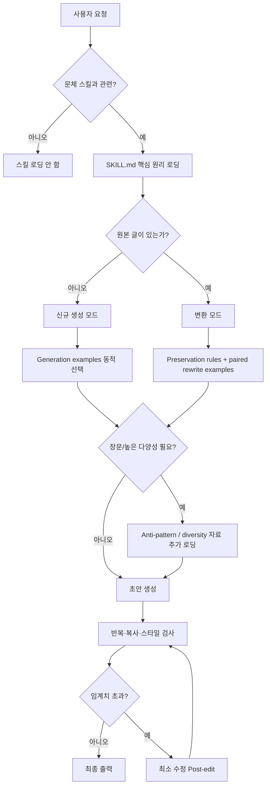

# LLM 에이전트의 특정 작가 문체 재현을 위한 프롬프트·스킬 설계 심층 리서치

## Executive Summary

특정 작가의 문체를 재현하는 LLM 에이전트는 **“작가의 특징을 규칙으로 길게 나열하는 시스템 프롬프트”보다, 짧은 판단 원리 + 다양하게 선별한 실제 예시 + 명시적 금지/보존 제약 + 생성 후 반복 제거 단계**를 결합하는 쪽이 현재의 공식 가이드와 2024~2026년 실증 연구에 가장 잘 부합한다. Anthropic은 예시를 톤·구조·형식을 유도하는 가장 신뢰할 만한 방법 중 하나로 보며 일반적으로 3~5개의 관련성 높고 다양한 예시를 권하고, 동시에 유연한 과업에서는 지시의 **이유와 목적을 설명하는 것이 경직된 명령보다 맥락 의존적 판단을 잘 유도할 수 있다**고 설명한다. 반대로 너무 포괄적인 스킬은 관련 없는 지시까지 모델이 따라가게 해 성능을 해칠 수 있다고 경고한다. citeturn10view0turn20view0turn20view2

이 결론은 문체 모방 연구와도 대체로 일치한다. 2025년 대규모 저자 문체 모방 연구에서는 5-shot이 zero-shot보다 여러 데이터셋에서 일관되게 높은 저자 일치도를 보였다. 예를 들어 GPT-4o의 저자검증 정확도는 Enron 이메일에서 85.02%에서 96.15%, Reddit에서는 56.66%에서 63.65%, Blog에서는 8.15%에서 19.37%로 상승했다. 다만 비정형적인 블로그·포럼 문체에서는 절대 성능이 여전히 낮았으며, 저자 분류 지표가 내용·주제 단서를 일부 포착할 수도 있다는 한계가 있다. 즉 **few-shot은 강력하지만 “몇 개 예시를 넣으면 문체가 해결된다”는 뜻은 아니다.** citeturn3view1turn16search0

“판단 원리”는 더 미묘하다. 추론 과제에서 예시들로부터 일반화 가능한 가이드라인을 추출하는 FGT 연구는 GPT-4-32k에서 평균 정확도 약 0.702의 few-shot 대비 약 0.912의 guideline 기반 방법을 보고했지만, 이는 문체 생성이 아니라 BBH 계열 추론 과제이므로 문체 영역에 그대로 일반화하면 안 된다. 반면 개인화 글쓰기의 TICL 연구에서는 단순히 예시의 스타일을 분석해 명시적으로 따르도록 하는 CoT식 접근이 simple few-shot을 일관되게 능가하지 못했고, **실패 출력·부정 예시와 그 실패 이유를 함께 제공하는 contrastive explanation**이 더 중요했다. Claude 3 Sonnet에 대한 TICL ablation에서는 전체 방법의 저자 대비 승률 54.5%에서 explanation을 제거하면 46.0%로 내려간 반면 초기 ICL 예시만 제거했을 때는 52.0%였다. citeturn12view0turn12view2turn5view0turn5view1

따라서 실무적으로는 세 방식 중 하나를 고르는 문제가 아니라 역할을 분리해야 한다.

| 구성 요소 | 맡겨야 할 역할 | 권장 비중 |
|---|---|---:|
| **판단 원리** | 모호한 상황에서 무엇을 우선할지, 왜 그렇게 판단할지 | 가장 중요 |
| **few-shot 예시** | 실제 문장 리듬·밀도·전환·어휘 선택을 암묵적으로 시연 | 가장 강력한 스타일 앵커 |
| **명시적 규칙·제약** | 반드시 지켜야 하는 길이, 금칙 표현, 사실 보존, 반복 한도 | 소수만 강하게 |
| **contrastive anti-example** | “겉보기엔 비슷하지만 틀린 문체”를 정의 | 반복적 AI 문체 억제에 중요 |
| **post-edit / critic** | 첫 생성에서 생긴 습관적 기교·복사·과장 제거 | 긴 글에서 사실상 필수 |

스타일 과적합의 핵심 원인은 단순히 낮은 temperature가 아니다. 고정된 3~5개 예시, 지나치게 구체적인 “작가 특징 30개”, 항상 같은 문장 시작 방식, 같은 비유·대시·수사 의문문을 지시하면 모델이 그것을 **문체의 분포가 아니라 체크리스트**처럼 취급하기 쉽다. 연구에서도 단순 스타일 프롬프트가 목표 텍스트의 내용을 베껴 style classifier 점수를 올릴 수 있음이 관찰됐고, 개인화 글쓰기 연구에서는 few-shot이 “additionally”, “therefore” 같은 형식적 연결 표현을 과도하게 생성하는 경향도 보고됐다. citeturn13view0turn13view3turn5view1

이 때문에 최종 권고안은 **“Style Skill = 판단 시스템 + 예시 검색기 + 다양성 제어기 + 검수기”**로 설계하는 것이다. Agent Skills의 progressive disclosure 구조를 그대로 적용하면 시작 시 약 100-token 규모의 `name`/`description`만 노출하고, 스타일이 실제로 필요한 요청일 때만 5,000-token 미만의 핵심 `SKILL.md`를 로딩하며, 신규 생성·리라이팅·문체 실패 사례·평가 루브릭 등은 조건이 성립할 때 개별 파일로 추가 로딩할 수 있다. 이는 불필요한 컨텍스트를 줄이고 서로 충돌하는 스타일 지시를 방지하는 구조적 이점이 있다. citeturn19view2turn20view0

**가장 권장하는 초기 프로덕션 구성은** `6~10개 판단 원리 + 3~5개 동적 few-shot + 1~2개 contrastive anti-example + 3~5개 hard constraint + 스타일 기교 예산(device budget) + 2차 repetition critic`이다. 샘플링 파라미터를 지원하는 모델에서는 첫 A/B 테스트를 `temperature 0.6~0.8` 대 `0.9~1.0` 정도로 두되, `top_p`까지 동시에 바꾸지 않는 것이 원인 분석에 유리하다. 이 숫자는 보편적 최적값이 아니라 **초기 탐색값**이며, 최신 모델은 샘플링 파라미터 지원 여부 자체가 모델별로 다르므로 프롬프트 수준 랜덤화와 후보 생성 방식도 함께 준비해야 한다. OpenAI 문서는 `temperature`와 `top_p` 중 하나를 우선 조정하도록 안내하며, nucleus sampling 자체는 반복적·퇴행적 생성 문제에 대응하기 위해 제안된 고전적 방법이다. citeturn6search2turn7search6

## 연구 범위와 증거를 읽는 방법

본 조사는 2020~2026년 자료를 중심으로 공식 OpenAI·Anthropic·Agent Skills 문서, ACL/NAACL 및 arXiv 원전 연구, 한국어 학술자료, Reddit·Stack Overflow의 실무 경험을 함께 비교했다. 공식 문서는 현재 제품의 실제 프롬프트·스킬 동작을 판단하는 데 우선했고, 학술 논문은 실험 수치가 있는 경우에 우선했다. Reddit·Stack Overflow는 통제 실험이 아닌 경우가 대부분이므로 **가설 생성용 저신뢰 증거**로만 취급했다. OpenAI 역시 프롬프트 결과가 비결정적이고 모델 스냅샷마다 다를 수 있으므로, 프로덕션에서는 모델 버전 고정과 별도의 평가 스위트를 권한다. citeturn19view3turn17search5

특히 “규칙 vs few-shot vs principles”의 완벽한 3-arm 문체 실험은 현재 공개 문헌에서 흔하지 않다. 따라서 아래 결론은 세 종류의 증거를 조합한다. 첫째는 **직접적인 문체 모방 실험**, 둘째는 프롬프트·개인화에 관한 일반 실험, 셋째는 공식 에이전트/스킬 설계 지침이다. 서로 다른 과업의 결과를 같은 것으로 취급하지 않고, 전이 가능성이 낮은 결과는 별도로 표시했다.

또 하나 중요한 용어 문제가 있다. 사용자가 언급한 **“데코레이션(decoration)”은 조사한 문체 생성 문헌에서 temperature, top-p, repetition penalty처럼 표준화된 디코딩 파라미터 명칭으로는 확인되지 않았다.** 따라서 이 보고서에서는 이를 실무적으로 **“은유, 괄호 삽입, 파편문, 수사 의문, 감각 묘사, 대시 등 눈에 띄는 장식적 문체 기교를 별도 풀(pool)로 관리하고 확률적으로 할당하는 방법”**으로 정의한다. 이 해석에는 불확실성이 있다.

평가에서도 “작가처럼 느껴진다” 하나만 재면 안 된다. 2025년 register-based style-transfer 연구는 스타일 강도와 의미 보존 사이에 근본적인 trade-off가 있음을 보여주며, 단순한 style accuracy가 목표 예문의 **내용 복사** 때문에 부풀려질 수 있음을 지적한다. 해당 연구에서 단순 방법은 스타일 점수가 높게 나오는 경우에도 목표 예시와의 Rouge-1 중복이 다른 방법보다 3~5배 수준으로 커지는 문제가 관찰됐다. 따라서 문체 시스템은 적어도 **스타일 일치도·내용 품질·출력 간 다양성·원문/예시 복사율** 네 축으로 평가해야 한다. citeturn13view0turn13view3

한국어 평가에서도 단일 어휘 다양성 수치보다는 여러 층위를 보는 것이 바람직하다. 2026년 한국어 문학 번역 연구는 창의적 변이를 평가하면서 BERTScore·BLEU 계열, TTR/MATTR, 품사·구문적 특징 등을 함께 분석하는 설계를 사용한다. 이를 작가 문체에 옮기면 한국어에서는 어절 단위 Distinct-n뿐 아니라 **문자/형태소 n-gram, 평균 문장 길이, 연결어·종결형 분포, 부사절·종속절 패턴**을 함께 추적하는 것이 더 안정적인 실무 설계라고 판단된다. citeturn21view1

권장 평가식은 다음처럼 생각할 수 있다.

\[
Score = w_s S_{style}+w_c S_{content}+w_q S_{quality}+w_d S_{diversity}
-w_r P_{repetition}-w_l P_{leakage}
\]

여기서 `S_style`만 최대화해서는 안 된다. **좋은 스타일 모델은 한 샘플이 목표 작가와 가장 비슷한 모델이 아니라, 서로 다른 주제에서 같은 “판단 습관”을 유지하면서도 문장 표면은 반복하지 않는 모델**이어야 한다. 이 원칙은 personalized writing 연구의 contrastive explanation 결과와 register-based style transfer의 스타일-의미 trade-off 모두와 부합한다. citeturn5view0turn13view0

## 규칙 나열, few-shot, 판단 원리의 효과 비교

세 방식의 차이를 가장 간단히 표현하면 **규칙은 경계를 만들고, 예시는 분포를 보여주며, 원리는 새로운 상황에서의 판단 함수를 제공한다.**

### 관련 사례 비교

| 방식 | 확인된 근거 | 강점 | 대표 실패 모드 | 문체 에이전트에서의 적합도 |
|---|---|---|---|---|
| **규칙 나열** | Anthropic Agent Skills는 fragile한 작업에는 구체적 지시가 필요하되, 지나치게 포괄적인 스킬은 오히려 성능을 해칠 수 있다고 설명한다. citeturn20view0turn20view2 | 길이, 형식, 금칙어, 사실 보존처럼 pass/fail 가능한 항목에 강함 | 규칙 충돌, 모든 문단에서 동일한 기교 실행, 긴 프롬프트의 관련성 저하 | **필수이지만 소량 사용** |
| **few-shot** | Anthropic은 예시가 톤·구조·형식 유도에 매우 신뢰성이 높으며 보통 3~5개의 관련성 높고 다양한 예시를 권고한다. citeturn10view0 | 리듬·구문·어휘·전환 등 언어로 명시하기 힘든 특징 전달 | 예시의 소재까지 복사, 특정 기교 과적합, 예시 선택 편향 | **직접적 스타일 앵커로 가장 중요** |
| **5-shot 문체 모방** | GPT-4o 저자검증: Enron 85.02→96.15, Reddit 56.66→63.65, Blog 8.15→19.37. citeturn3view1turn16search0 | 실제 저자 문체에 대한 직접 실험 근거 | 비정형 개인 문체에서는 여전히 낮은 절대 성능 | **강한 직접 증거** |
| **판단 원리/가이드라인** | Anthropic은 유연한 과업에서는 “왜”를 설명하는 것이 rigid directive보다 상황 판단에 도움이 될 수 있다고 한다. citeturn20view2 | 예시에 없는 상황으로 일반화, 충돌 해결 | 너무 추상적이면 “우아하게 써라” 수준의 무의미한 조언이 됨 | **few-shot과 결합할 때 매우 유용** |
| **학습된 guideline** | FGT 추론 실험에서 few-shot 평균 약 .702, many-shot .724, guideline 기반 방식 .912. 단, 문체가 아니라 reasoning benchmark. citeturn12view0turn12view2 | 다수 사례를 압축해 재사용 가능 | 영역 전이 불확실 | **간접 증거** |
| **예시 + 스타일 분석(CoT)** | TICL 연구에서 예시의 스타일을 명시적으로 분석해 따르라고 하는 방식은 simple few-shot을 일관되게 이기지 못했다. citeturn5view0 | 해석 가능성 | 모델이 자명하거나 피상적인 특징만 언어화할 수 있음 | **단독 적용 비추천** |
| **contrastive 원리 + 실패 설명** | TICL ablation에서 explanation 제거가 초기 예시 제거보다 더 큰 성능 저하를 보인 조건이 있다. citeturn5view0turn5view1 | “무엇이 왜 잘못됐는지”를 학습 | 실패 사례 품질이 나쁘면 반대로 고착될 가능성 | **가장 유망한 보강법** |

핵심적으로 **“principles가 examples보다 낫다”는 단순 결론은 근거가 부족하다.** FGT는 강력한 guideline 결과를 보였지만 reasoning 과제이고, personalized writing의 TICL에서는 스타일을 말로 분석하는 것만으로는 simple few-shot보다 안정적으로 좋아지지 않았다. 반면 실패 출력과 그 이유를 제공하는 설명형 피드백은 효과가 컸다. 따라서 문체 원리는 “이 작가는 짧은 문장을 쓴다” 같은 통계 요약보다 아래와 같이 **의사결정 규칙**으로 써야 한다. citeturn12view2turn5view0

> **나쁜 원리**: “문장은 짧고 시적이어야 한다.”
> **더 좋은 원리**: “정보 전달이 필요한 문장은 평이하게 유지한다. 정서적 전환점에서만 문장을 짧게 끊는다. 모든 문단을 파편문으로 만들면 효과가 사라지므로 반복하지 않는다.”

> **나쁜 원리**: “은유를 자주 쓴다.”
> **더 좋은 원리**: “추상 감정을 직접 이름 붙이는 대신 구체적 사물·행동으로 드러내되, 이미 장면 자체가 감정을 전달하면 추가 은유를 넣지 않는다.”

이 차이가 중요한 이유는 문체가 **feature inventory**가 아니라 **feature selection policy**이기 때문이다. 작가가 은유를 쓴다는 사실보다 “언제 은유를 쓰고 언제 평문을 택하는가”가 더 일반화 가능한 지식이다. Anthropic의 스킬 가이드가 유연한 작업에서 목적과 이유를 설명하고, 특정 instance의 답이 아니라 재사용 가능한 procedure를 가르치라고 하는 방향과 정확히 맞닿아 있다. citeturn20view2turn20view3

### 커뮤니티 실험은 무엇을 보여주는가

커뮤니티 증거도 같은 방향의 힌트를 주지만 신뢰도는 낮춰 해석해야 한다. 최근 Reddit의 한 자가 실험은 약 500~600개의 문학적 subtext 데이터로 네 방식을 비교해 작은 데이터에서는 few-shot이 fine-tuning보다 유리했다고 주장하지만, 독립 재현·통계 검증이 공개 학술 연구 수준으로 제공된 것은 아니다. 따라서 **강한 결론의 근거가 아니라 실무 가설**로 보는 것이 안전하다. citeturn18search0

반대 사례도 있다. 다른 Reddit 사용자는 본인 에세이 3~4편, 약 4,000단어를 통째로 system context에 넣어도 GPT-4가 계속 “robotic style”로 썼다고 보고했다. 즉 **raw text의 양 자체가 스타일 학습량을 의미하지 않는다.** 예시의 다양성과 선택, 예시와 원리 사이의 구조화가 더 중요한 변수가 될 수 있다. 이는 Anthropic이 예시는 “relevant and diverse”해야 의도치 않은 패턴을 피할 수 있다고 명시하는 것과도 맞는다. citeturn18search14turn10view0

Stack Overflow에서도 few-shot을 user/assistant 쌍으로 넣는 실무 관행이 널리 제안됐지만, 답변자 스스로 프롬프트 엔지니어링이 여전히 실험적이라 양쪽 방식을 실제로 시험해야 한다고 설명한다. 따라서 커뮤니티 경험을 **“이 구조가 무조건 낫다”는 증거로 사용하기보다는 eval 후보를 만드는 데 사용**해야 한다. citeturn18search2

### 권장 비교 실험

실제 작가 A에 대한 스킬을 만든다면 최소한 다음 factorial A/B를 실시하는 것이 좋다.

| 변수 | 권장 조건 |
|---|---|
| Prompt representation | `Rules only`, `Few-shot only`, `Principles only`, `Principles + Few-shot`, `Principles + Few-shot + Anti-example` |
| 예시 수 | 0 / 1 / 3 / 5 |
| 예시 선택 | 고정 / 주제 유사 검색 / 스타일 클러스터 다양화 검색 |
| 과업 | 신규 생성 / 기존 글 style rewrite |
| 샘플링 | deterministic-ish / moderate / diverse |
| 반복 | 각 동일 input에 최소 3회, 가능하면 5회 |
| 주제 | 학습 예시와 가까운 주제 + 완전히 다른 주제 모두 포함 |
| 길이 | 짧은 글 / 중간 / 장문 |

모델 스냅샷, max output, source text, 과업 지시와 평가자는 고정한다. OpenAI는 모델 스냅샷 고정과 eval suite를 명시적으로 권장하며, Agent Skills 트리거 평가 역시 비결정성 때문에 동일 질의를 여러 번 실행하도록 권한다. citeturn19view3turn20view4

가령 30개 테스트 프롬프트 × 5개 prompt condition × 3회 반복이면 조건당 90개, 전체 450개 출력이 된다. 평가는 blind pairwise human judgment와 자동 지표를 병행한다. 주요 지표는 `Style Similarity`, `Task/Content Quality`, `Meaning Preservation(rewrite만)`, `Self-BLEU`, `Distinct-2/3`, `mean pairwise embedding similarity`, `signature-device repetition`, `reference-text overlap`, `input tokens`, `output tokens`, `latency`다. Verbalized Sampling 연구도 lexical·semantic diversity를 분리해 보고, semantic diversity에 생성물 임베딩의 평균 pairwise similarity를 활용한다. citeturn15search6

통계적으로는 프롬프트/주제가 동일한 paired 구조이므로 평균만 비교하지 말고 pairwise win rate와 bootstrap 95% CI를 함께 보고하는 것이 좋다. 저자·주제·길이가 많아지면 mixed-effects model로 `prompt_method`의 효과와 `topic/author`의 random effect를 분리하면 더 안정적이다. 이는 본 보고서가 제안하는 실험 설계이며 특정 벤더의 필수 규격은 아니다.

## 스타일 패턴 과적합을 막는 생성·디코딩 설계

문체 모방에서 가장 위험한 실패는 모델이 작가의 “분포”를 배우지 않고 **눈에 띄는 표면적 신호 몇 개를 과잉 반복하는 것**이다. 예를 들어 실제 작가가 20페이지에 세 번 쓴 대시나 수사 의문문을 모델이 “대표적 특징”으로 인식해 매 문단마다 실행할 수 있다. TICL 연구에서 simple few-shot 결과가 형식적인 연결어를 더 많이 쓰는 현상은 이런 문제의 한 형태다. citeturn5view1

### 과적합 방지 기법 비교

| 기법 | 작동 방식 | 권장 초기값·구현 | 장점 | 위험·한계 | 평가 |
|---|---|---|---|---|---|
| **Temperature** | 확률분포를 평탄화/예리화 | 지원 모델에서 `0.6~0.8` baseline과 `0.9~1.0` diversity arm부터 A/B. 최적값 아님 | 어휘·구문 선택 폭 증가 | 높이면 문체 이탈·사실 오류 가능 | Style score와 diversity를 동시 측정. Nucleus sampling 계열 연구는 단순 likelihood-maximization의 반복·퇴행 문제를 지적한다. citeturn6search2 |
| **Top-p / nucleus** | 누적확률 p 안의 토큰 집합에서 샘플링 | 예: temperature를 기본값에 두고 `top_p=.90/.95` 별도 arm | 낮은 확률 꼬리를 잘라 품질·다양성 절충 | temperature와 동시에 바꾸면 원인 해석 어려움 | Self-BLEU, quality, hallucination. OpenAI도 보통 temperature 또는 top-p 중 하나를 우선 바꾸도록 안내한다. citeturn7search6 |
| **Frequency penalty** | 이미 자주 나온 토큰에 추가 페널티 | 지원 API에서 작은 양수부터, 예: `0.2~0.5` 탐색 | 동일 어휘·구문 반복에 직접적 | 의도된 반복·운율도 죽일 수 있음 | 반복 n-gram/1k chars, style fidelity. OpenAI는 양수 frequency penalty가 반복 가능성을 낮춘다고 문서화한다. citeturn7search6 |
| **Repetition penalty / no-repeat ngram** | open-weight decoding에서 재등장 확률 억제 | `repetition_penalty≈1.05~1.15` 탐색; 심한 collapse에만 `no_repeat_ngram_size=3` 등 | 명백한 phrase loop에 강함 | 문학적 반복까지 제거 가능 | exact n-gram repetition + human rhythm score. Hugging Face generation API가 관련 파라미터를 제공한다. citeturn6search13 |
| **Diversity penalty** | group beam 간 같은 토큰 선택을 벌점 | group beam을 실제 사용하는 경우에 한정 | 다중 beam 차별화 | 일반적인 sampling API의 “창의성 knob”가 아님 | 후보 간 Self-BLEU | Hugging Face에서 group beam용 파라미터로 정의된다. citeturn6search13 |
| **장식 기교 budget** | 은유·대시·파편문 등을 확률적 슬롯으로 관리 | 문단당 salient device `0~1`, 동일 device `2문단 cooldown` 등부터 평가 | “매 문단 같은 기교”를 구조적으로 방지 | 문헌 표준 기법이 아니라 본 보고서의 설계안 | device entropy, max device share |
| **예시 랜덤화** | 항상 같은 3개 예시 대신 다양하게 retrieval | style cluster별 1개씩, 내용 유사도가 너무 높은 예시는 제외 | example overfit와 소재 복사 완화 | 지나친 랜덤화는 스타일 앵커 약화 | run-to-run style variance, reference overlap |
| **Contrastive anti-example** | 비슷해 보이지만 잘못된 출력을 함께 보여주고 이유 설명 | positive 3~5 + anti-example 1~2 | 피상적 AI 문체를 구체적으로 억제 | anti-example이 너무 많으면 그것도 모방 | TICL의 explanation/negative ablation이 직접적인 근거. citeturn5view0turn5view1 |
| **Verbalized Sampling** | 모델에게 여러 후보와 확률을 먼저 구성하게 함 | 5개 접근/voice plan 생성 → 최고확률만 쓰지 말고 후보 샘플링 | API sampling knob 없이도 다양화 가능 | 추가 호출·토큰 비용 | 2025/26 연구에서 creative writing 다양성 1.6~2.1× 향상 보고. citeturn15search2turn15search6 |
| **Post-edit critic** | 1차 생성 후 반복 기교만 탐지·수정 | 2차 pass는 “새로 쓰기”가 아니라 최소 편집으로 제한 | 긴 글의 누적 반복 제거에 효과적 | critic이 스타일 자체를 평준화할 수 있음 | before/after style + repetition + edit distance |
| **Copy guard** | 참조 문구와 긴 중복을 검출 | longest-common-substring, Rouge-L/character ngram threshold | 문체 대신 문장 복사를 하는 문제 방지 | 흔한 관용구는 오탐 | register 연구의 target-content-copy 문제와 직접 관련. citeturn13view3 |

표의 temperature·penalty 숫자는 **프로덕션 기본값이 아니라 탐색 시작점**이다. 모델별 출력분포가 다르고, 최신 API에서는 모델에 따라 sampling parameter 지원 범위가 달라질 수 있다. 따라서 “Claude면 temperature=0.8”처럼 벤더 전체에 고정값을 박는 스킬은 피해야 한다. 모델이 파라미터를 노출하지 않는 경우에도 **예시 랜덤화, device budget, verbalized sampling, multi-candidate reranking**은 적용 가능하다. citeturn6search3turn6search6

특히 temperature를 올리는 것만으로 문체 과적합을 해결하는 전략은 권하지 않는다. temperature는 **어떤 선택지가 반복되는지 이해하지 않고 분포 전체를 흔드는 방법**이기 때문이다. “모든 문단에 한 번씩 대비법을 쓴다”는 시스템 프롬프트가 있다면 temperature가 높아져도 모델은 대비법 자체를 계속 수행할 가능성이 높다. 먼저 구조적 원인, 즉 고정 규칙과 예시의 편향을 제거한 다음 sampling을 조정해야 한다. Anthropic 역시 overly comprehensive instructions가 관련 없는 경로를 유발할 수 있다고 설명한다. citeturn20view0

가장 실용적인 것은 **기교 빈도 자체보다 기교의 분포를 측정하는 것**이다. 예를 들어 `metaphor 42%, fragment 37%, rhetorical-question 12%, parenthesis 9%`라면 하나의 장치가 거의 독점하지 않는지 entropy나 HHI를 계산할 수 있다. 실제 작가 corpus에서도 동일 feature distribution을 추출해 생성물과 비교하면 단순 “은유 개수”보다 훨씬 유용하다.

추천 QC 조건 예시는 다음과 같다.

```text
STYLE OVERUSE CHECK

- 동일한 눈에 띄는 문장 시작 패턴이 3회 연속 나오면 수정한다.
- 동일 수사 장치가 두 문단 연속 핵심 장치로 사용되면 하나를 평문으로 바꾼다.
- 수정은 의미·사실·화자의 태도를 바꾸지 않는 최소 편집으로 한다.
- 목표 작가다운 특징을 '추가'하려 하지 말고, 과잉 사용된 특징만 줄인다.
- 참조 예문의 고유 구절을 재사용하지 않는다.
```

여기서 마지막 두 문장이 중요하다. post-editor에게 다시 “작가답게 만들어라”고 지시하면 첫 번째 모델과 같은 스타일 장식을 한 번 더 덧씌우는 악순환이 생긴다. post-edit의 목적은 **style amplification이 아니라 distribution repair**여야 한다.

평가에서도 Self-BLEU 하나는 부족하다. Self-BLEU와 Distinct-n은 어휘 차이를 보기 좋지만 의미적으로 같은 문장을 동의어만 바꿔도 다양하게 평가할 수 있다. 2025년 Verbalized Sampling 연구가 pairwise embedding cosine을 이용한 semantic diversity를 함께 측정하는 이유가 여기에 있다. ACL 2024 연구 역시 Self-BLEU·Distinct 계열은 어휘 다양성을 포착하는 반면 분포 품질 지표와는 다른 정보를 제공한다고 분석한다. citeturn15search1turn15search6

따라서 문체 과적합 대시보드는 최소 다음 다섯 값을 동시에 보는 것이 좋다: `style similarity`, `Self-BLEU`, `mean semantic similarity`, `signature-device concentration`, `reference overlap`. **style similarity가 상승하면서 diversity가 하락하면 좋은 개선이 아니라 스타일 모드 붕괴일 가능성**을 의심해야 한다.

## Claude Skills류 progressive disclosure 설계

Agent Skills의 현재 공개 specification은 스킬을 세 단계로 로딩한다. 모든 스킬의 `name`과 `description`은 시작 시 약 100 tokens 수준의 metadata로 노출되고, 실제 스킬이 활성화되면 전체 `SKILL.md`를 읽으며 5,000 tokens 미만이 권장된다. 추가 `references/`, `scripts/`, `assets/`는 실제 필요할 때만 읽는다. `SKILL.md`는 500 lines 미만을 권장한다. citeturn19view2

이 구조는 문체 스킬에 매우 적합하다. 특정 작가를 위한 15,000-token짜리 “문체 백과사전”을 매 호출마다 넣을 필요가 없기 때문이다.

권장 디렉터리 구조는 다음과 같다.

```text
writer-style/
├── SKILL.md
├── references/
│   ├── style-principles.md
│   ├── linguistic-profile.md
│   ├── anti-patterns.md
│   └── preservation-rules.md
├── examples/
│   ├── generation-short.md
│   ├── generation-long.md
│   ├── rewrite-paired.md
│   └── contrastive-failures.md
├── evaluation/
│   ├── rubric.md
│   └── thresholds.json
└── scripts/
    ├── style_stats.py
    ├── repetition_check.py
    └── overlap_check.py
```

`SKILL.md`에는 모든 지식을 넣지 않고 **라우팅에 필요한 최소 정보**만 둔다. Anthropic의 스킬 가이드는 “references를 보라” 같은 일반 지시보다 “API가 non-200일 때 `api-errors.md`를 읽어라”처럼 구체적인 로딩 조건을 명시하라고 권한다. 문체에도 동일하게 적용할 수 있다. citeturn20view0

예를 들면:

```text
When to load additional files

- 신규 글을 작성할 때:
  read examples/generation-short.md
  장문(약 1,500자 이상)이면 examples/generation-long.md도 읽는다.

- 사용자가 기존 텍스트를 제공하고 "고쳐 써줘/문체를 바꿔줘"라고 할 때:
  read references/preservation-rules.md
  read examples/rewrite-paired.md

- 첫 draft에서 동일 수사 장치가 반복되거나 장문 생성일 때:
  read references/anti-patterns.md
  run scripts/repetition_check.py

- 스타일 품질을 평가하거나 프로덕션 검수를 할 때:
  read evaluation/rubric.md

- 참조 문장과의 복사가 의심될 때:
  run scripts/overlap_check.py
```

이 구조의 의사결정 흐름은 다음과 같다.



### 트리거 설계

Agent Skills 공식 가이드는 `description`이 사실상 첫 번째 라우터 역할을 하므로 under-specified하면 필요한 스킬이 안 뜨고, 너무 넓으면 불필요하게 뜬다고 설명한다. 약 20개의 트리거 테스트를 만들고 8~10개 positive, 8~10개 negative를 두며, 특히 키워드는 겹치지만 실제로는 다른 작업인 **near-miss negative**를 중요하게 본다. 동일 질의도 세 번 정도 실행해 trigger rate를 보는 것이 제안된다. citeturn19view1turn20view4

문체 스킬의 `description`은 다음처럼 “작가 이름 포함 여부”만으로 트리거하지 않는 편이 좋다.

```yaml
description: >
  Use this skill when the user asks to create, revise, or transform prose
  using the registered writer-style profile, preserve an established personal
  writing voice, or evaluate whether a draft matches that profile.
  Do not use it for factual questions about the writer, biography, quotation
  lookup, or literary criticism unless text generation/rewriting is also requested.
```

그러면 positive trigger는 “이 초안을 내 기존 말투로 다시 써줘”, “지난 글과 같은 리듬으로 새 칼럼 작성”처럼 만들고, negative는 “그 작가의 생애를 설명해줘”, “이 작품의 주제를 분석해줘”처럼 만든다. “작가”라는 키워드가 겹치는 near miss를 반드시 넣는 것이 중요하다. 이는 공식 trigger-eval 방법론과 직접 대응한다. citeturn19view1

트리거 최적화에서도 train/validation을 나눠야 한다. Agent Skills 가이드는 약 60%를 개선용 train query, 40%를 일반화 확인용 validation query로 분리해 description이 특정 문구만 외우는 것을 막도록 권한다. citeturn20view4

### 비용과 지연

Progressive disclosure의 가장 큰 장점은 “사용하지 않는 스타일 데이터까지 매 요청마다 넣는 비용”을 피하는 데 있다. 공식 spec 기준으로 metadata는 스킬당 약 100 tokens이고, 전체 instruction은 스킬 활성화 때만 들어가며, resource files는 필요할 때만 들어간다. 따라서 여러 작가·여러 업무용 skill을 함께 설치하더라도 모든 장문의 style guide가 무조건 context에 들어가는 구조가 아니다. citeturn19view2

실제 비용·latency 숫자는 모델과 가격표가 바뀌므로 고정적으로 제시하기 어렵지만, **고정 core prefix → 조건부 resource** 순서가 유리하다. OpenAI도 반복적으로 사용하는 prompt prefix를 앞부분에 안정적으로 배치하면 prompt caching을 통한 비용·latency 절감에 유리하다고 설명한다. citeturn19view3

다만 progressive disclosure도 지나치게 잘게 쪼개면 파일 로딩·툴 호출이 많아진다. Anthropic은 너무 좁은 스킬은 한 작업에 여러 스킬을 로딩해야 해 overhead와 지시 충돌 위험을 높인다고 설명한다. 따라서 “은유 skill”, “문장길이 skill”, “대화체 skill”처럼 문체 요소별로 전부 분리하기보다 **한 작가/한 voice profile을 하나의 coherent skill로 묶고 그 내부 reference를 조건부 로딩**하는 것이 낫다. citeturn20view0

### 보안·프라이버시

문체 학습 자료는 개인 메일, 미공개 원고, 사내 글쓰기 자료처럼 민감할 가능성이 있으므로 일반적인 public style prompt보다 높은 수준의 데이터 관리가 필요하다. Agent Skills 구현 가이드는 프로젝트 폴더 자체가 신뢰되지 않을 수 있으므로 project-level skill을 **사용자가 신뢰한 저장소에서만 로딩하는 trust check**를 고려하라고 명시한다. citeturn14search2

외부 웹페이지·메일·업로드 문서·툴 결과는 indirect prompt injection을 포함할 수 있으므로 이를 system instruction과 섞어 승격하지 않아야 한다. Anthropic은 외부 tool result를 untrusted content로 취급하고 별도의 tool-result 영역에 유지하도록 권한다. citeturn14search0turn14search20

현재 Claude의 Skills 사용은 code execution 기능과 결합되어 있으며, 조직 환경에서는 code execution/file creation 설정을 관리할 수 있다. Anthropic의 관리형 code-execution은 sandbox 환경으로 설명되고, Team/Enterprise 환경에서는 민감한 경우 network egress를 끄는 구성이 가능하다. 기능별 retention·ZDR·HIPAA 호환성은 현재 제품 설정에 따라 달라질 수 있으므로 배포 시점의 공식 eligibility 표를 다시 확인해야 한다. citeturn14search1turn14search12turn14search24turn14search32

따라서 private writer corpus에는 최소한 다음 운영 원칙을 적용하는 것이 좋다. `SKILL.md`에는 원문을 직접 넣지 않고 추상화된 principles만 저장한다. 실제 예시는 접근통제된 resource에서 task별 최소량만 가져온다. 원고 안의 지시는 데이터이지 instruction이 아니라는 경계를 유지한다. production log에는 원문 전체보다 style feature와 evaluator score를 우선 기록한다. 코드 실행이 불필요한 경우 arbitrary script 실행 권한을 주지 않는다. 이 중 일부는 공식 기능이 아니라 본 보고서의 보수적 운영 권고지만, untrusted skills와 prompt injection에 관한 공식 위협 모델에서 직접 파생된 설계다. citeturn14search2turn14search20

## 신규 생성용 가이드와 기존 글 변환용 가이드의 차이

신규 생성과 기존 글 변환을 같은 prompt로 처리하는 것은 권하지 않는다. 두 작업은 최적화 목적이 다르다. **신규 생성은 “무엇을 새로 선택할 자유를 줄 것인가”가 핵심이고, 변환은 “무엇을 절대로 바꾸지 않을 것인가”가 핵심**이다. Style-transfer 연구 역시 변환 품질에서 스타일 강도와 meaning preservation을 동시에 평가한다. citeturn13view0turn13view3

| 항목 | 신규 생성 | 기존 글 변환 |
|---|---|---|
| 최우선 목표 | 새로운 내용 + 일관된 voice | 원 의미 보존 + 목표 voice로 표면 표현 이동 |
| Prompt 중심 | 판단 원리·플롯/논지·독자·목적 | preservation contract + 스타일 변환 원리 |
| few-shot | **3~5개의 다양한 target-style exemplar**를 초기값으로 권장. Anthropic 일반 가이드와 5-shot 저자 모방 결과가 근거. citeturn10view0turn3view1 | **1~3개의 paired rewrite + target exemplar**부터 실험 권고. 이 숫자는 실무 heuristic이며 보편적 최적값은 미확인 |
| 예시 선택 | 현재 주제와 너무 가까운 것은 피하고 스타일 다양성을 우선 | source와 구조적 난도가 비슷한 paired 예시 우선 |
| 구조 | 재설계 가능 | 별도 요청 없으면 단락 기능·논지 순서 보존 |
| 사실·숫자 | task spec에 맞게 생성/검증 | 고유명사·숫자·인용·인과관계는 hard constraint |
| 정서 | 작가 profile 안에서 새로 설계 가능 | 원문의 stance·강도·화자의 태도 변화 최소화 |
| 주요 위험 | 공식적 AI 문체, 기교 반복, 참조 예시 소재 복사 | 의미 누락, 사실 추가, 주장 강도 변화, 원문 구조 파괴 |
| 핵심 평가 | style + quality + novelty + diversity | style + semantic preservation + edit discipline |
| 자동 지표 | authorship/style score, Self-BLEU, semantic diversity | MIS/SBERT/METEOR 계열 + style score + source overlap. Register 연구가 이 다목적 평가를 사용한다. citeturn13view0 |

신규 생성용 core prompt는 다음 구조가 적합하다.

```text
[ROLE / GOAL]
등록된 voice profile의 판단 습관을 사용해 새 글을 쓴다.
참조 예문의 문구나 소재를 재사용하지 않는다.

[STYLE PRINCIPLES]
1. ...
2. ...
3. ...

[CONFLICT PRIORITIES]
내용의 정확성 > 화자의 의도 > 자연스러움 > 문체적 장식.
문체 특징을 보여주기 위해 사실이나 논리를 왜곡하지 않는다.

[DEVICE POLICY]
모든 특징을 동시에 보여주지 않는다.
각 문단에서 필요한 특징만 선택한다.
눈에 띄는 동일 기교를 연속적으로 반복하지 않는다.

[TASK]
목적:
독자:
주제:
길이:
필수 내용:

[FEW-SHOT EXEMPLARS]
동적으로 선택한 3~5개.

[ANTI-EXAMPLES]
AI스럽게 과장된 실패 예 1~2개 + 왜 실패인지.

[OUTPUT]
최종 본문만.
```

기존 글 변환은 앞부분이 달라져야 한다.

```text
[TRANSFORMATION CONTRACT]
이 작업은 새로 쓰기가 아니라 style-preserving rewrite다.

반드시 보존:
- 사실, 숫자, 고유명사
- 인과·조건·부정 관계
- 핵심 주장과 주장 강도
- 화자의 관점과 정서적 태도
- 별도 허가가 없으면 단락의 수사적 기능과 논지 순서

변경 가능:
- 문장 길이와 연결 방식
- 어휘 선택
- 리듬
- 직접/간접 표현
- 목표 voice에 필요한 국소적 구문

금지:
- 원문에 없는 사실·주장 추가
- 더 극단적인 확신/비난/찬양으로 바꾸기
- style을 강조하려고 불필요한 비유를 추가하기

[SOURCE]
<source>
...
</source>

[TARGET STYLE PRINCIPLES]
...

[PAIRED EXAMPLES]
source → successful rewrite 1~3쌍

[SELF-CHECK]
출력 전 각 사실·숫자·주장을 source와 대조한다.
```

여기서 기존 글의 “톤을 보존한다”는 표현은 주의해야 한다. target style로 바꾸면 표면적 tone은 어느 정도 변할 수 있으므로, 보존해야 할 것은 “격식도” 자체보다 **화자의 stance, 감정의 방향, 강도, 독자와의 관계**로 정의하는 것이 더 명확하다. 예를 들어 냉정한 비판을 “친근한 작가 문체”로 바꾸더라도 원문보다 더 긍정적인 주장으로 바꾸면 실패다.

긴 변환에서는 직접 한 번에 rewrite하는 것보다 계층적 접근이 유리하다는 최근 연구도 있다. 2025년 ZeroStylus는 문장 단위와 문단 수준의 구조를 계층적으로 포착하는 방식이 직접 프롬프트보다 스타일 일관성·내용 보존·표현 품질의 종합 평가에서 개선을 보고했다. 다만 해당 연구의 정확한 설정과 언어가 모든 한국어 작가 문체에 그대로 전이된다는 증거는 없으므로 장문 rewrite에서 시험할 가치가 있는 **중간 신뢰도 설계 근거**로 보는 것이 적절하다. citeturn3view4

실무에서는 이를 두 단계로 단순화할 수 있다.

`source → semantic skeleton → style realization`

첫 번째 pass는 사실·논지·단락 기능만 추출하고, 두 번째 pass가 목표 스타일로 실현한다. 마지막 verifier가 원문과 다시 비교한다. 이렇게 하면 모델이 스타일화를 위해 source의 의미를 무심코 변경했는지 추적하기 쉬워진다. Register-style 연구가 style과 meaning을 별도 축으로 평가하는 것과 같은 설계 철학이다. citeturn13view0

## 실행 가능한 설계 권고

아래는 바로 구현할 수 있는 권고안이다. 파라미터 숫자는 특별히 “공식 권장”이라고 적힌 경우를 제외하면 **초기 실험값**이며, 작가·장르·모델별 eval을 거쳐 조정해야 한다.

| 권고 | 구체적 구현 단계 | 파라미터·구성 예시 | 반드시 볼 평가 지표 | 근거 |
|---|---|---|---|---|
| **Hybrid core를 기본으로 한다** | 작가 corpus에서 특징을 나열하지 말고 6~10개 decision principle로 압축 → hard constraint 3~5개 → 실제 예시 추가 | `principles 6~10`, `few-shot 3~5`, `anti-example 1~2` | Human style win-rate, AV/style classifier, task success | Anthropic은 diverse examples 3~5개를 권하고, flexible tasks에서 “why” 기반 지시를 권한다. citeturn10view0turn20view2 |
| **예시보다 먼저 “언제 특징을 쓰지 않는가”까지 정의한다** | 각 특징에 `use_when`, `avoid_when`, `conflict_priority` 필드 생성 | 예: `fragment: emotional-turn only; cooldown 2 paragraphs` | 동일 장치 연속률, device entropy | 단순 스타일 분석은 few-shot보다 항상 낫지 않았고, contrastive explanations이 중요했다. citeturn5view0turn5view1 |
| **few-shot을 고정하지 않는다** | corpus를 문장 길이·격식도·대화 비율·수사 장치 등으로 cluster → 요청마다 서로 다른 cluster에서 exemplars 검색 | 기본 3~5개; 동일 문서에서 2개 이상 뽑지 않는 arm부터 테스트 | reference overlap, run-to-run diversity, style fidelity | Anthropic은 examples의 다양성을 명시적으로 강조하며, 5-shot은 저자 모방에서 zero-shot보다 일관되게 개선됐다. citeturn10view0turn3view1 |
| **실패 예와 이유를 보관한다** | production failure → “잘못된 문체”와 원인을 `contrastive-failures.md`에 축적 → 관련 경우에만 로딩 | 한 호출에 anti-example 1~2개부터 | 과장된 기교율, formal-AI phrase rate, human naturalness | TICL ablation에서 explanations의 제거가 큰 저하를 유발했다. citeturn5view0turn5view1 |
| **신규 생성과 rewrite를 파일 수준에서 분리한다** | task classifier → generation/rewrite router → 서로 다른 examples와 rubric 로딩 | generation `3~5 exemplars`; rewrite `1~3 paired examples`부터 탐색 | generation: novelty/diversity; rewrite: semantic preservation | Style-transfer 연구는 meaning preservation을 별도 핵심 축으로 다룬다. citeturn13view0turn13view3 |
| **sampling은 구조 수정 후 튜닝한다** | 먼저 prompt repetition 원인 제거 → temperature arm 또는 top-p arm을 하나씩 A/B | 예: `T=.7/.9`; 또는 T 고정 후 `top_p=.90/.95`; 동시에 모두 바꾸지 않음 | style, Self-BLEU, semantic diversity, factuality | Nucleus sampling은 반복적 degeneration을 완화하는 기반 연구가 있으며 OpenAI는 temperature/top-p 중 하나씩 조정하는 방향을 안내한다. citeturn6search2turn7search6 |
| **지원되는 경우 작은 repetition penalty를 실험한다** | exact phrase loop가 확인된 조건에만 활성화 | API frequency penalty `0.2~0.5` 탐색; open model repetition penalty `1.05~1.15` 탐색 | repeat ngram/1k chars, intentional repetition loss | OpenAI/Hugging Face가 관련 repetition-control 파라미터를 제공한다. citeturn7search6turn6search13 |
| **장식 기교 budget을 별도 상태로 관리한다** | 생성 전 후보 기교 pool → 문단별 0~1개 선택 → 동일 기교 cooldown → 필요 없으면 none 허용 | `device_count/paragraph ≤1`, `cooldown=2`를 초기 arm으로 | device HHI/entropy, human “overwritten” score | 본 보고서의 설계 제안. “decoration”은 조사 문헌의 표준 파라미터가 아님 |
| **다중 후보를 생성하되 최고확률 후보만 고르지 않는다** | 3~5개 plan/voice realization 생성 → style/content 필터 → 낮은 빈도 후보도 일정 확률로 선택 | `K=5`부터 | pairwise embedding diversity, quality pass rate | Verbalized Sampling은 creative writing 다양성 1.6~2.1× 증가를 보고했다. citeturn15search2turn15search6 |
| **post-edit를 “최소 수정” 전용으로 분리한다** | 1차 draft → repetition/copy checker → 문제 span만 critic에 전달 → style 추가 금지 | max 1~2 revision pass | edit distance, style before/after, content preservation | 스타일을 다시 증폭시키기보다 failure explanation 기반 수정이 TICL 결과에 더 부합한다. citeturn5view0 |
| **copy guard를 필수화한다** | few-shot 및 corpus와 출력의 ngram·long substring·Rouge overlap 검사 → 임계치 초과 span rewrite | threshold는 corpus로 calibration | reference overlap, style score 유지 여부 | 스타일 점수가 target-content copying으로 부풀려질 수 있다는 연구 결과. citeturn13view3 |
| **Skill은 progressive disclosure로 분리한다** | metadata → SKILL core → generation/rewrite/anti-pattern/eval 자료를 조건부 로딩 | metadata 약 100 tokens; core `<5,000 tokens`, `<500 lines` 권장 | trigger precision/recall, loaded tokens, latency | Agent Skills 공식 specification. citeturn19view2 |
| **트리거도 별도 eval한다** | positive 8~10, near-miss negative 8~10 → 각 3회 → train/validation 분리 | 약 20 query, 3 runs, train 60%/val 40% | trigger precision, recall, false-load rate | Agent Skills trigger 가이드의 구체적 권장값. citeturn19view1turn20view4 |
| **private style corpus는 instruction과 분리한다** | 원문은 access-controlled references → 최소 필요 예시만 retrieval → 외부 문서 instruction 실행 금지 | untrusted repo는 trust gate; 필요 시 network egress 차단 | unauthorized loads, injection tests, corpus exposure | Agent Skills trust guidance 및 Anthropic prompt-injection 지침. citeturn14search2turn14search20turn14search32 |
| **단일 style score로 출시하지 않는다** | style/content/diversity/repetition/copy/cost를 하나의 eval suite로 CI 실행 | 모델·prompt 변경마다 regression eval | 각 축 + pairwise human win rate + cost/latency | OpenAI는 모델 스냅샷 고정과 prompt eval suite를 권고하고 Agent Skills도 실행 기반 grading을 권한다. citeturn19view3turn14search26 |

실제 production gate는 예컨대 다음처럼 정의할 수 있다.

```text
Release candidate가 통과하려면:

1. Style pairwise win rate가 baseline 대비 +5pp 이상
2. Rewrite meaning-preservation은 baseline보다 악화되지 않음
3. Self-BLEU 또는 semantic-diversity가 baseline보다 유의하게 나빠지지 않음
4. signature-device concentration이 작가 corpus의 허용 구간 내
5. source/example overlap violation < 1%
6. human "과장되거나 기계적으로 작가 흉내를 냄" 판정률이 감소
7. 평균 input tokens 및 p95 latency가 사전에 정한 예산 내
```

특히 `+5pp`나 `<1%`는 산업 표준이 아니라 **팀이 정하는 release criterion의 예시**다. 중요한 것은 “style score가 올라갔으니 성공”이 아니라 다른 축이 함께 유지되는지를 보는 것이다.

권장 eval matrix는 아래와 같다.

| 평가 축 | 자동 지표 | 인간 평가 질문 |
|---|---|---|
| 스타일 | authorship verification, stylometric distance, feature distribution | “작가의 일반적 판단·리듬과 어느 쪽이 더 가까운가?” |
| 자연스러움 | LLM rubric + 문법/fluency scorer | “특징을 억지로 과시한다는 느낌이 있는가?” |
| 내용 | task-specific factual/coverage checks | “요청한 내용을 빠뜨리거나 새 사실을 만든 적이 있는가?” |
| Rewrite 보존 | SBERT/MIS/BERTScore + entity/number checks | “원 주장·감정 강도·인과관계가 변했는가?” |
| 어휘 다양성 | Distinct-n, Self-BLEU | “같은 표현을 습관적으로 되풀이하는가?” |
| 의미 다양성 | mean pairwise embedding similarity | “다른 실행에서도 사실상 같은 전개만 내는가?” |
| 기교 다양성 | device entropy/HHI, sentence-opener distribution | “은유/대시/파편문 같은 장치가 과도한가?” |
| 복사 | Rouge-L, char ngram, longest common substring | “참조 예시의 고유 문장을 베낀 흔적이 있는가?” |
| 운영 | tokens, latency, skill trigger rate | “스타일이 필요 없는 작업에도 스킬이 로딩되는가?” |

최종적으로 추천하는 production architecture는 다음과 같다.

```text
User request
    ↓
Task / trigger classifier
    ↓
Compact style principles
    ↓
Mode router ────────────────┐
    ↓                       │
Generation          Rewrite │
    ↓                       ↓
Diverse exemplars     Preservation contract
    ↓                  + paired exemplars
    └──────────┬────────────┘
               ↓
       Draft generation
               ↓
  Style / meaning / repetition /
       overlap measurement
               ↓
        Threshold exceeded?
          ↙           ↘
        No             Yes
        ↓               ↓
      Output       Minimal post-edit
                        ↓
                    Re-check
```

이 구조의 중요한 철학은 **“작가의 문체를 더 많이 설명할수록 더 잘 따라 한다”가 아니라 “모델이 지금 필요한 스타일 정보만 보고, 특징을 언제 선택하고 언제 억제해야 하는지 알게 한다”**는 것이다. 이는 최근의 Agent Skills 설계가 context를 가능한 한 작고 관련성 높게 유지하려는 방향, OpenAI가 반복적·불필요한 프롬프트를 줄이라고 권하는 방향, personalized writing 연구에서 단순한 스타일 분석보다 오류와 설명을 통한 학습이 더 효과적이었던 결과와 일관된다. OpenAI의 최신 agent 관련 내부 평가에서는 반복되는 instructions/examples/tool descriptions를 줄인 lean prompt가 해당 **코딩 에이전트** 평가에서 약 10~15% 성능 향상, 41~66% token 감소, 33~67% 비용 감소를 보인 사례가 보고됐지만, 이는 문체 생성 실험이 아니므로 “짧을수록 문체가 10% 좋아진다”로 해석해서는 안 된다. 방향성 근거로만 보는 것이 정확하다. citeturn11view0

### 핵심 출처, 링크와 인용문

아래는 이 보고서의 설계 권고에 가장 큰 영향을 준 자료다. 인용문은 원문의 짧은 핵심 구절만 제시했다.

| 출처 | 성격·관련성 | 핵심 인용문 | 링크 |
|---|---|---|---|
| Anthropic, **Prompting best practices** | 공식 가이드. examples·clarity·context의 직접 근거 | “**Examples are one of the most reliable ways to steer Claude**…” citeturn10view0 | citeturn10view0 |
| Agent Skills, **Best practices for skill creators** | principles vs rigid instruction, context 절약, progressive disclosure | “**For flexible instructions, explaining why can be more effective than rigid directives**” citeturn20view2 | [원문](https://agentskills.io/skill-creation/best-practices) |
| Agent Skills, **Specification** | progressive disclosure의 공식 token tier | “**Metadata (~100 tokens)… Instructions (< 5000 tokens recommended)… Resources (as needed)**” citeturn19view2 | [원문](https://agentskills.io/specification) |
| Agent Skills, **Optimizing skill descriptions** | trigger eval, positive/negative, 반복 실행, train/validation | “**Aim for about 20 queries: 8-10 that should trigger and 8-10 that shouldn’t.**” citeturn19view1 | [원문](https://agentskills.io/skill-creation/optimizing-descriptions) |
| OpenAI, **Prompt engineering** | 모델 고정, eval suite, instruction hierarchy, caching | “**Building tests and evaluation suites that measure prompt behavior**” citeturn19view3 | [원문](https://developers.openai.com/api/docs/guides/prompt-engineering) |
| OpenAI, **Prompting** | prompt를 코드처럼 버전 관리하고 eval할 근거 | “**Run your prompt tests and evaluation cases every time you publish**” citeturn17search2 | [원문](https://developers.openai.com/api/docs/guides/prompting) |
| Cho et al., **Tuning-Free Personalized Alignment via Trial-Error-Explain In-Context Learning**, NAACL Findings 2025 | 개인화 글쓰기에서 few-shot·style analysis·explanation을 직접 비교 | 논문의 핵심은 negative samples와 explanations를 ICL에 추가하는 데 있으며 personalized writing에서 높은 pairwise win rate를 보고한다. citeturn15search3turn5view0 | [ACL 원문 PDF](https://aclanthology.org/2025.findings-naacl.326.pdf) |
| **Catch Me If You Can? Not Yet: LLMs Still Struggle to Imitate the Implicit Writing Styles of Everyday Authors**, 2025 | 400명+ 저자, 다수 모델·도메인의 few-shot 문체 모방 평가 | 5-shot이 저자 일치도에서 zero-shot보다 일관되게 우수하지만 비정형 개인 문체는 여전히 어렵다. citeturn3view1turn16search0 | [arXiv 원문](https://arxiv.org/abs/2509.14543) |
| **Can We Only Use Guideline Instead of Shot in Prompt?**, 2024 | guideline가 examples를 압축·일반화할 가능성에 대한 실험 | few-shot 평균 약 .702 대비 guideline 방법 약 .912. 단, reasoning task라는 중요한 한계가 있다. citeturn12view0turn12view2 | citeturn12view0 |
| **Steering Large Language Models with Register Analysis for Arbitrary Style Transfer**, 2025 | 스타일 정의, meaning preservation, content copying 문제의 직접 근거 | 스타일 강도와 의미 보존의 trade-off를 평가하며 단순 style metric이 복사로 부풀려질 수 있음을 보인다. citeturn13view0turn13view3 | citeturn13view0 |
| Holtzman et al., **The Curious Case of Neural Text Degeneration**, NeurIPS 2020 | nucleus sampling의 기초 연구 | likelihood 중심 decoding이 bland·repetitive text를 만들 수 있고 nucleus sampling을 대안으로 제시한다. citeturn6search2 | [arXiv 원문](https://arxiv.org/abs/1904.09751) |
| Zhang et al., **Verbalized Sampling: How to Mitigate Mode Collapse and Unlock LLM Diversity**, 2025/2026 | prompt-level diversity 제어의 최신 연구 | “**in creative writing, VS increases diversity by 1.6-2.1x**” citeturn15search2 | [arXiv 원문](https://arxiv.org/abs/2510.01171) |
| 임진, **LLM 문학 번역의 창의적 변이에 대한 계량적 분석**, 2026 | 한국어권 창의적 텍스트 평가 설계 참고 | 창의적 변이를 어휘·구문 변화와 원문 의미 보존을 함께 보도록 설계한다. citeturn21view1 | [KCI 원문](https://journal.kci.go.kr/kats/archive/articlePdf?artiId=ART003318653) |
| Reddit, **I tested 4 methods to make LLMs write literary subtext** | 커뮤니티 자가 실험; 저신뢰 보조 근거 | “**few-shot prompting outperforms fine-tuning on every metric that matters**”라는 작성자 주장. 독립 검증 없음. citeturn18search0 | citeturn18search0 |
| Stack Overflow, **How to format a few-shot prompt for GPT4 Chat Completion API?** | 커뮤니티 구현 경험 | user/assistant 쌍으로 few-shot을 구성하는 방식을 제안하나, 답변도 실제 실험 필요성을 인정한다. citeturn18search2 | citeturn18search2 |

현재 증거를 종합하면 가장 높은 신뢰도로 권할 수 있는 것은 **“규칙을 많이 써라”도 “예시만 넣어라”도 아니다.** 구체적인 문체 에이전트의 최적 구조는 **짧은 판단 원리로 선택 기준을 정의하고, 3~5개의 다양한 실제 예시로 언어적 분포를 보여주며, 실패 예와 설명으로 잘못된 모방 방향을 봉쇄하고, 하드 제약은 의미·형식·반복 한도처럼 검증 가능한 것에만 사용한 뒤, progressive disclosure와 post-edit를 통해 장문에서 생기는 패턴 붕괴를 통제하는 것**이다. 이 조합이 현재 공식 가이드, 개인화 문체 연구, style-transfer 연구, 최신 diversity 연구 사이에서 가장 일관되게 지지되는 설계다. citeturn10view0turn20view2turn5view0turn13view0turn15search6