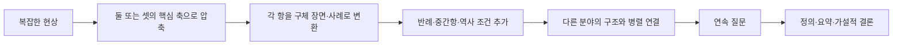

# 채사장 문체 특성 인벤토리: 공개 자료 기반 정량·정성 분석

## Executive Summary

이 보고서의 가장 중요한 결론은 두 가지다.

첫째, **질문의 전제 가운데 하나는 수정되어야 한다.** 공개 자료를 교차검증하면 유튜브 **‘지식한입’은 채사장이 운영하는 채널로 확인되지 않는다.** ‘지식한입’은 별도 채널 ID `UCi9Sl8GnFdYoqEVXnojBPJw`를 쓰는 독립 채널이고, 채사장의 유튜브 채널은 **‘채사장 유니버스’**다. 2020년 언론 보도도 채사장이 자신의 유튜브 채널 ‘채사장 유니버스’를 시작했다고 명시한다. 따라서 ‘지식한입’ 자막을 채사장 문체 자료로 넣으면 **타인의 문체를 채사장에게 귀속시키는 코퍼스 오염**이 생기므로 이 분석에서는 제외했다. citeturn24search0turn24search5turn24search14

둘째, 실제 채사장 문체의 핵심은 흔히 생각하는 **“많은 지식을 가볍게 나열하는 문체”가 아니다.** 공개 본문과 인터뷰를 정량화하면, 그의 기본 동작은 **복잡한 대상을 둘 또는 셋의 축으로 압축 → 구체 장면·비유로 시각화 → 연속 질문으로 추론 → 다시 개념적 결론으로 회수**하는 방식이다. 그는 인터뷰에서도 전문가들이 각자 자기 분야만 이야기하는 상황에서 자신은 “독립된 분야들이 어떻게 연결되어 있는가”를 보여주고 싶었다고 직접 설명했다. citeturn26view1

이 보고서에서 신뢰도가 가장 높은 **문어 정량 코퍼스 W**는 리디가 저자명과 함께 공개한 『지적 대화를 위한 넓고 얕은 지식 1·2·제로』의 “본문 일부”를 사용했다. 문장 종결부호 기준으로 복원한 결과 **252문장, 2,490어절**이다. 이 코퍼스에서 10어절 이하 단문은 **61.9%**, 21어절 이상 장문은 **4.4%**였다. 즉 채사장의 기본 박자는 단문이다. 다만 긴 조건문이나 열거문을 드물게 넣고 곧 단문으로 끊으면서 **“짧게 전제 → 길게 확장 → 짧게 판정”**하는 리듬을 만든다. 공개 본문은 출판사가 제공한 저자 본문이어서 리뷰·홍보문보다 문체 측정 신뢰도가 높다. citeturn23view0turn23view1turn21view2turn23view2

반면 **구어 표본 O**는 2016년 채널예스 장문 인터뷰에서 인터뷰어 질문을 제외하고 분석 가능한 채사장 응답을 155문장·1,707어절로 분절한 비교 표본이다. 여기서는 문장 끝의 약 **95.5%가 ‘-요/-죠/-거든요/-인데요’ 계열**이고, 정확히 ‘같아요’로 끝나는 문장만 18개였다. 따라서 글에서는 단정적인 한다체를 쓰면서도 말에서는 판단을 “것 같아요”, “생각이 들어요” 같은 인식·추정 표현으로 완충한다는 **매체별 어조 차이**가 뚜렷하다. citeturn26view0turn26view2turn26view3turn26view4

전환어 역시 선입견과 약간 다르다. 문어 코퍼스 W에서 지정어 가운데 **‘결국’ 3회, ‘그런데’ 2회, ‘흥미로운 것은’ 1회, ‘다시 말하면’ 정확형 0회**였고, 대신 변형 **‘다시 말해’가 1회**였다. ‘사실’ 문자열은 3회지만 대부분 명사적·부사적 용법이며 독립적인 “사실,”식 전환어로 애용된다고 보기 어렵다. 문어의 실제 상위 전환은 **‘그리고’ 7회, ‘하지만’ 6회, ‘우선’ 4회**다. 반대로 구어 표본에서는 **‘그런데’ 9회, ‘그래서’ 6회, ‘그러니까’ 5회**로 대화적 접속이 크게 늘어난다. citeturn19view0turn19view2turn19view11turn19view14turn20view7turn20view20turn20view21turn26view0turn26view1

또 하나의 뚜렷한 특징은 **질문을 도입부보다 논증 중간에 많이 쓴다는 점**이다. 조사한 공개 발췌 블록 17개의 첫 문장을 코딩하면 질문으로 바로 시작하는 사례는 0개였다. 대신 정의, 사건, 사과·코끼리·장기판 같은 구체물을 먼저 제시한 뒤 질문을 연쇄적으로 던진다. 문어 코퍼스 W에는 물음표 문장 19개가 있었고, 그중 **2개 이상 질문이 연속되는 묶음이 4곳, 총 9문장**이었다. citeturn21view0turn21view1turn22view3turn22view6

따라서 채사장의 재현 가능한 “시그니처”는 특정 유행어 하나보다 **구조적 습관**에 있다. 가장 반복적으로 나타나는 것은 **우리/당신을 논증 안으로 끌어들이기, 이분·삼분 구조 만들기, 구체 사례를 추상 구조의 등가물로 사용하기, 질문으로 한 단계씩 독자를 이동시키기, 마지막에 정의 또는 짧은 명제로 압축하기**다. 그의 ‘얕음’은 문장이나 사유가 얕다는 뜻이라기보다, 스스로 밝힌 것처럼 **전문 분야 사이를 이동할 수 있도록 핵심 구조를 추상화하는 편집 전략**에 가깝다. citeturn21view5turn19view15turn21view8


## 조사 범위와 코퍼스

### 자료 선정과 귀속 문제

우선 채사장과 ‘지식한입’의 관계부터 검증했다. 유튜브 검색 결과 채사장의 공개 채널은 **‘채사장 유니버스’(@chesajang_universe)**이고, 채널에는 글쓰기·오디오북·라이브·일상 콘텐츠 등이 묶여 있다. 2020년 7월 스포츠서울도 채사장이 유튜브로 돌아왔다며 그의 채널을 다뤘다. 반면 ‘지식한입’은 별도의 채널 ID와 브랜드를 사용하며, 최근 채널 소개 기사도 운영자 개인보다 채널 자체의 편집 방식이 전면에 나선 독립 지식 채널로 기술한다. 공개적으로 신뢰할 만한 출처에서 두 채널의 운영 주체가 동일하다는 근거는 확인되지 않았다. citeturn24search0turn24search2turn24search5turn24search6turn24search14

따라서 **‘지식한입’ 스크립트·자막은 이 분석에서 전부 제외**했다. 구어체 비교는 채사장 본인임을 확실히 확인할 수 있는 인터뷰 발화와 ‘채사장 유니버스’ 영상 메타데이터, 강연 기사로 대체했다. ‘채사장 유니버스’에는 『열한 계단』, 『우리는 언젠가 만난다』 등의 오디오북 콘텐츠도 공개돼 있으나, 이번 웹 수집에서는 유튜브의 완전한 자동자막 텍스트를 안정적으로 회수하지 못했기 때문에 **유튜브 자막을 정량 빈도 분모에 넣지는 않았다**. 채널과 해당 콘텐츠의 존재 자체는 확인된다. citeturn24search0turn24search2turn24search9

채사장의 옛 네이버 블로그도 저자 프로필에서 **공식 링크로 연결**되어 있다. 다만 네이버 블로그 본문은 이번 공개 웹 수집 환경에서 robots 제한으로 원문 텍스트를 독립적으로 가져올 수 없었다. 팬이 운영하는 별도 ‘채사장’ 관련 블로그는 저자 본인의 글로 오인할 위험이 있어 배제했다. 리디 저자 프로필에는 팟캐스트 ‘지대넓얕’ 진행 경력과 함께 본인의 블로그 링크가 명시돼 있다. citeturn23view0

정량 분석의 핵심 자료는 다음과 같다.

| 코퍼스 | 자료와 메타데이터 | 용도 | 분석 지위 |
|---|---|---|---|
| W1 | 채사장, 『지적 대화를 위한 넓고 얕은 지식 1』 개정판, 웨일북, 종이책 2020-02-05·전자책 2020-02-21, 리디 공개 “본문 일부” citeturn5view0turn23view0 | 문장·전환·논증 | 정량 핵심 |
| W2 | 채사장, 『지적 대화를 위한 넓고 얕은 지식 2』 개정판, 웨일북, 종이책 2020-02-05·전자책 2020-02-21, 리디 공개 본문 citeturn21view1turn23view1 | 삼분법·대화·정의 | 정량 핵심 |
| W0 | 채사장, 『지적 대화를 위한 넓고 얕은 지식 제로』, 웨일북, 종이책 2020-01-18·전자책 2020-02-04, 리디 공개 본문 citeturn5view1turn21view2turn23view2 | 리듬·질문·비유·분야 횡단 | 정량 핵심 |
| O | 임나리 인터뷰, 「채사장 ‘세상을 단순하게 볼 필요가 있다’」, 채널예스, 2016-02-18 citeturn18view0turn26view0 | 구어체 비교 | 정량 비교 |
| Q1 | 『열한 계단』 공개 인용·발췌, 2016년 출간작 citeturn16search4turn16search9 | 에세이 문체 교차검증 | 정성 보조 |
| Q2 | 『우리는 언젠가 만난다』 공개 인용·서평 발췌, 2017–2018년 출간작 citeturn12search4turn16search2turn16search14 | 은유·철학적 문체 교차검증 | 정성 보조 |
| Y | ‘채사장 유니버스’ 유튜브 공식 채널 및 2020년 이후 영상 목록 citeturn24search0turn24search3turn24search9 | 구어 매체 확인 | 메타데이터 |
| L | 2026년 강연 기사: ‘나’와 ‘세상’을 질문으로 연결하는 인문학 강연 citeturn0search16 | 최근성 검증 | 정성 보조 |

기간은 요청대로 **최근 약 10년을 우선**했다. 정량 자료는 모두 2020년 공개 본문이며, 『열한 계단』·『우리는 언젠가 만난다』와 2026년 강연을 교차검증에 썼다. 2016년 2월 채널예스 인터뷰는 현재 기준 엄밀한 10년 범위를 약 반년 벗어나지만, 편집된 간접인용이 아니라 채사장의 장문 답변을 다량 보존한 자료라서 **구어 기준선으로 예외 포함**했다. 최신작 『지적 대화를 위한 넓고 얕은 지식 무한』의 공개 판매 페이지도 확인했지만, 공개된 긴 설명문이 저자 본문인지 출판사 카피인지 분리가 어려운 부분은 정량 코퍼스에서 제외했다. citeturn4view1turn5view2

### 정량화 규칙

문어 W는 출처 표지·“중에서” 같은 편집 문구를 제거하고 `. ? !`를 기본 문장 경계로 삼았다. 따옴표 속 가상 대화도 저자가 의도적으로 설계한 서술 장치이므로 문장 리듬에는 포함했다. 결과는 **252문장·2,490어절**이다. 어절은 공백 단위이며, 단문은 ≤10어절, 중문은 11–20어절, 장문은 ≥21어절로 조작적으로 정의했다. 이 수치는 책 전체의 전수조사가 아니라 **출판사가 공개한 본문 표본에 대한 재현 가능한 표본 통계**다. 원자료는 세 리디 본문이다. citeturn23view0turn23view1turn21view2turn23view2

구어 O는 인터뷰어의 질문을 빼고 공개된 채사장 답변에서 분석 가능한 발화를 문장 단위로 분절한 비교 표본으로, **155문장·1,707어절**이다. 따라서 W와 O 사이의 차이는 “채사장의 모든 글 대 모든 말”의 모집단 차이라고 단정하기보다 **출판용 설명문과 장문 인터뷰 발화 사이의 차이**로 해석해야 한다. citeturn26view0turn26view1turn26view2turn26view4turn26view8


## 문장 리듬과 전환어

**문장 리듬 — (a) 관찰 요약**

채사장의 문어는 기본적으로 **단문 우세형**이다. 252문장 가운데 156문장, 즉 **61.9%가 10어절 이하**였다. 평균은 9.9어절, 중앙값은 9어절이다. 반대로 21어절 이상 장문은 11문장, **4.4%**에 불과하다. 따라서 “긴 설명을 계속 밀어붙이는 인문서 문체”와는 거리가 있다. citeturn23view0turn23view1turn21view2turn23view2

| 문장 길이 | 문어 W 문장 수 | 문어 W 비율 | 구어 O 문장 수 | 구어 O 비율 |
|---|---:|---:|---:|---:|
| 단문 ≤10어절 | 156 | **61.9%** | 82 | **52.9%** |
| 중문 11–20어절 | 85 | 33.7% | 62 | 40.0% |
| 장문 ≥21어절 | 11 | **4.4%** | 11 | **7.1%** |
| 합계 | 252 | 100% | 155 | 100% |
| 평균 길이 | 9.9어절 | — | 11.0어절 | — |
| 중앙값 | 9어절 | — | 10어절 | — |

구어가 오히려 약간 길다. 인터뷰에서는 “그런데/그래서/그러니까”로 생각을 이어 붙이기 때문에 평균 문장이 11.0어절이고 장문 비율도 7.1%까지 오른다. 즉 **말은 더 친근하지만 통사적으로 반드시 더 짧지는 않다.** citeturn26view0turn26view1turn26view5

문어 리듬의 핵심은 길이 평균보다 **길이의 대비**에 있다. 짧은 명제들을 여러 개 연속시킨 뒤 조건을 많이 단 장문을 한 번 넣고, 다시 질문이나 결론 단문으로 끊는다. 특히 『제로』의 우주 논의에서는 여러 단계의 우주 규모를 한 문장 안에 중첩한 뒤 바로 짧은 반문으로 닫는다. 반대로 『지대넓얕 1』에서는 매우 짧은 명제를 연속시켜 권력·신·국가 같은 추상개념에 선언적인 리듬을 준다. citeturn22view0turn22view3

반복 구조를 엄격하게 코딩하면 다음과 같다. ‘3항 열거’는 문법적으로 평행한 세 단위를 하나의 묶음으로 제시한 경우만 세었고, 우연히 쉼표가 두 번 등장한 문장은 제외했다.

| 반복·병렬 장치 | W 확인 빈도 | 대표 형태 |
|---|---:|---|
| 명시적 3항 병렬 | **6회** | A/B/C 세 범주, 세 형용사, 세 감각 등 |
| 4항 이상 병렬 | **최소 5회** | 인도·중국·그리스·이스라엘, 세계관 4종 등 |
| 2문장 이상 연속 의문 | **4묶음** | 총 9개 질문문 |
| 전체 의문문 | **19문장** | 252문장의 7.5% |
| 단문→단문 인접 | **109회** | 전체 문장 인접쌍에서 가장 흔한 유형 |

이 수치가 보여주는 것은 **“3열거가 습관적으로 모든 문단에 들어간다”는 정도는 아니라는 것**이다. 오히려 더 강한 특징은 추상 대상을 **둘 또는 셋의 항으로 먼저 구조화한 뒤 각 항을 병렬 문장으로 확장**하는 방식이다. 『지대넓얕 2』의 절대주의·상대주의·회의주의가 대표적이다. citeturn21view1turn22view1

**(b) 출처·메타데이터.** 『지대넓얕 1·2』와 『제로』 리디 공개 본문, 웨일북, 모두 2020년판을 핵심 표본으로 사용했다. 구어 비교는 채널예스 2016-02-18 장문 인터뷰다. citeturn23view0turn23view1turn5view1turn18view0

**(c) 최소 인용 예시.** 단문 연타의 극단은 “**신은 요청된다. 지배자는 신을 부른다.**” 같은 형태다. citeturn22view0


**전환어 — (a) 관찰 요약**

우선 사용자가 지정한 다섯 표현을 살펴보면, 실제 사용 양상은 다음과 같다. ‘사실’은 **문자열 출현**과 **담화 전환 기능**을 구분했다.

| 지정 표현 | 문어 W 원시 출현 | 전환어로 판단되는 빈도 | 구어 O | 판정 |
|---|---:|---:|---:|---|
| 그런데 | **2** | 2 | **9** | 특히 구어에서 강함 |
| 흥미로운 것은 | **1** | 1 | 0 | 존재하나 시그니처급 고빈도는 아님 |
| 사실 | 3 | 약 1 | 2 | 명사·강조부사 용법이 섞여 있음 |
| 결국 | **3** | 3 | 0 | 문어의 귀결 표지 |
| 다시 말하면 | **0** | 0 | 0 | 정확형은 표본에서 없음 |
| 다시 말해 | **1** | 1 | 0 | 실제 확인된 변형 |

특히 **“다시 말하면”은 예상과 달리 0회**이고 “다시 말해”가 1회다. ‘흥미로운 것은’도 『제로』의 관념론 설명에서 정확히 등장하지만 1회뿐이다. 따라서 이 두 표현을 채사장의 대표 버릇말로 단정하는 것은 현재 공개 표본으로는 과하다. citeturn19view3turn19view4turn19view8turn19view9turn19view13turn19view14turn20view7

반대로 실제 상위 전환어를 후보 어휘집 방식으로 집계하면 다음과 같다. 여기서 빈도는 모든 가능한 한국어 담화표지를 자동 발견한 것이 아니라 **본문에서 반복적으로 관찰되는 25개 전환 후보를 사전 지정해 센 것**이다.

| 순위 | 문어 W 전환어 | 빈도 | 1,000어절당 |
|---:|---|---:|---:|
| 1 | 그리고 | **7** | 2.81 |
| 2 | 하지만 | **6** | 2.41 |
| 3 | 우선 | **4** | 1.61 |
| 4= | 결국 | **3** | 1.20 |
| 4= | 그렇다면 | **3** | 1.20 |
| 6= | 그런데 | **2** | 0.80 |
| 6= | 다만 | **2** | 0.80 |
| 6= | 다음으로 | **2** | 0.80 |
| 6= | 어쩌면 | **2** | 0.80 |
| 6= | 예를 들어 | **2** | 0.80 |
| 6= | 물론 | **2** | 0.80 |
| 이하 | 그래서·그러나·왜냐하면·반대로·즉·다시 말해 등 | 각 1 | 0.40 |

공개 본문에서 ‘그리고’는 단순 첨가뿐 아니라 **절차적 진행**을 담당하고, ‘하지만’은 앞에서 세운 단순한 모델에 반례·제약을 붙이는 데 쓰인다. ‘우선/다음으로’는 설명을 명시적으로 분절한다. 『지대넓얕 1』에서는 이성이 수행하는 두 역할을 “우선… 다음으로…”로 분리하며, 『제로』의 사과-시각 설명도 같은 순차 설명법을 쓴다. citeturn20view7turn20view8turn20view25turn20view26

**전환어 빈도 막대차트 — 문어 W**

```text
그리고       7  ███████
하지만       6  ██████
우선         4  ████
결국         3  ███
그렇다면     3  ███
그런데       2  ██
다만         2  ██
다음으로     2  ██
어쩌면       2  ██
예를 들어    2  ██
물론         2  ██
그래서       1  █
그러나       1  █
왜냐하면     1  █
반대로       1  █
즉           1  █
다시 말해    1  █
```

매체 차이는 더 극적이다. O 표본에서는 **그런데 9회 > 그래서 6회 > 그러니까 5회 = 실제로 5회**가 상위권이다. 즉 글에서의 “우선/다음으로/결국”이 **정리된 논증의 표지**라면, 말에서의 “그런데/그래서/그러니까”는 생각을 실시간으로 이어가는 **대화적 연결고리**다. 채사장의 구어체를 문어체로 흉내 내려 할 때 “그런데”를 그대로 많이 넣으면 오히려 인터뷰 말투 쪽으로 기울 가능성이 높다. citeturn19view15turn26view0turn26view1turn26view4turn26view5

**(b) 출처·메타데이터.** 문어는 웨일북 2020년 3종 공개 본문, 구어는 채널예스 임나리 인터뷰(2016-02-18)를 분리 분석했다. citeturn23view0turn23view1turn23view2turn18view0

**(c) 최소 인용 예시.** 실제 재진술 표지는 정확히 “**다시 말해,**”로 확인된다. citeturn22view0 『제로』에는 “**흥미로운 것은**”이라는 진입구도 한 차례 확인된다. citeturn22view6


## 어조와 도입 방식

**어조 — (a) 관찰 요약**

채사장 문어의 기본 종결은 **한다체 평서형**이다. W의 252문장 중 기계적·수동 코딩으로 평서형 ‘-다’ 계열로 분류된 것은 약 **201문장, 79.8%**다. 의문문은 19문장(7.5%)이고, 나머지는 대화체·파편문·청유·명령 등이다. 출판 본문의 저자-독자 관계에서는 ‘합니다/해요’식 존댓말 종결이 관찰되지 않았다. 등장인물 대화의 “하네/하지” 등은 서술자 종결과 별도로 봐야 한다. citeturn21view0turn21view1turn22view3turn22view6

그 결과 글의 표면 어조는 상당히 단정적이다. **“X는 Y다”, “X는 요청된다”, “이것은 ~ 때문이다”**와 같이 정의와 판정을 선행시킨다. 그러나 내용상 불확실한 추론에서는 “어쩌면”, “~인지도 모른다”, “~일지 모른다”를 써서 **사실판단과 가설판단의 강도를 구별**한다. 즉 문장 종결은 단정적이어도 인식론적 확신의 수준은 무차별하게 세게 밀어붙이지 않는다. 『제로』의 축의 시대 해석은 바로 이런 완곡한 가설 종결을 쓴다. citeturn22view3turn22view4

구어는 거의 반대다. O 155문장 가운데 **148문장, 약 95.5%가 ‘-요/-죠/-거든요/-인데요’ 계열**로 끝났다. ‘-습니다’ 계열은 소수였으며, 정확히 **‘같아요’로 끝나는 문장만 18개, 11.6%**였다. “생각이 들어요”, “볼 수도 있거든요”, “것 같아요”처럼 자신의 판단을 **인식 주체에게 귀속시키는 방식**이 많다. citeturn26view0turn26view2turn26view3turn26view5

그러나 이것을 “항상 조심스럽고 모호하다”로 이해하면 안 된다. 논증의 전제가 충분하다고 느끼는 순간에는 구어에서도 “불가능해요”, “원천적으로 안 되는 거죠”처럼 갑자기 강한 판정을 내리고 곧바로 “왜냐하면”으로 근거를 붙인다. 따라서 채사장 특유의 확신 표현은 **상시 강한 어조**가 아니라 **완충 → 구조 제시 → 결정적 판정**의 단계화에 가깝다. citeturn21view6

| 항목 | 문어 W | 구어 O |
|---|---|---|
| 기본 종결 | 한다체 | 해요체 |
| 독자와 거리 | 설명자·서술자 | 대화 상대 |
| 확신 | “~다”, 정의·판정 | “생각해요/같아요”로 완충 |
| 강한 단정 | 비교적 상시 가능 | 논증 핵심점에서 선택적으로 강화 |
| 연결 방식 | 우선·다음으로·결국 | 그런데·그래서·그러니까 |
| 질문 | 논증 장치 | 상대와 사고를 공유하는 장치 |

**(b) 출처·메타데이터.** 문어는 2020년 웨일북 공개 본문 3종, 구어는 2016년 채널예스 인터뷰다. 2026년 강연 기사에서도 채사장은 ‘나’와 ‘세상’을 각각 질문의 대상으로 삼아 사유 과정을 설명해, 질문 중심의 자기 설명법이 최근까지 이어지는 것을 확인할 수 있다. citeturn23view0turn23view1turn23view2turn18view0turn0search16

**(c) 최소 인용 예시.** 구어에서 대표적인 완충 종결은 반복되는 “**것 같아요**”다. citeturn26view3 반대로 핵심 판정에서는 “**그건 불가능해요.**”까지 강해진다. citeturn21view6


**도입 방식 — (a) 관찰 요약**

공개 본문에서 출처 제목로 구분 가능한 발췌 블록 **17개**의 첫 진입 방식을 연구자 코딩했다. 분류는 첫 문장 또는 첫 단위의 주기능을 하나만 택했다.

| 진입 방식 | 블록 수 | 비율 | 특징 |
|---|---:|---:|---|
| 명제·정의 제시 | **7** | **41.2%** | “X는 ~다”로 논의 축 고정 |
| 장면·구체 사례 | **5** | **29.4%** | 장기판, 코끼리, 사과 등 |
| 비유·사유실험 | **2** | 11.8% | 잠/꿈, VR 등 |
| 역사적 시간축 | **1** | 5.9% | 2,500년 전 등 |
| 문제 상황 제시 | **1** | 5.9% | 우주의 규모와 인간 지위 |
| 메타 담화·전환 | **1** | 5.9% | “먼저 구분한 후…” |
| **질문문 자체로 첫 문장 시작** | **0** | **0%** | — |
| **명시적 역설문으로 첫 문장 시작** | **0** | **0%** | — |

즉 **질문형 도입이 채사장의 대표 도입법이라는 예상은 공개 표본에서는 지지되지 않는다.** 질문은 많지만, 질문부터 던지기보다 먼저 작은 세계를 만든다. 맘모스와 곡식, 장기판, 파잔을 당하는 코끼리, 빨간 사과 같은 **구체물을 독자의 눈앞에 놓은 뒤**, “왜?”, “어디에 있는가?”, “무엇을 의미하는가?”로 들어간다. citeturn21view0turn21view1turn22view3turn22view6

이것은 중요한 문체적 구별이다. 일반적인 ‘지식 크리에이터’의 질문형 후킹이 **“여러분, 왜 그런지 아시나요?”**라면, 채사장의 전형은 오히려 **사례 → 위화감 → 질문**이다. 『제로』의 사과 설명은 먼저 사과와 광원·시신경의 과정을 충분히 밟은 후에야 “빨간색은 어디에 있는가”로 이동한다. citeturn20view20turn20view24turn22view6

또 ‘역사 장면형’은 존재하지만 압도적인 주류는 아니다. 축의 시대 부분은 “지금으로부터 2500년 전”이라는 시간 위치를 잡고 인도·중국·그리스·이스라엘을 나란히 배열한다. 반면 역사·신화 논의에서는 역사 연대가 아니라 **잠들기 직전의 경험을 비유로 먼저 꺼낸다.** 주제에 따라 “역사적 사실→개념”과 “일상적 경험→개념”을 선택적으로 바꾸는 것이다. citeturn22view4turn22view5

**(b) 출처·메타데이터.** 블록 코딩은 리디가 2020년판 세 권에서 `<원시 공산사회>`, `<세 가지 중심 개념>`, `<우리 우주의 크기>` 등으로 출처를 표시한 공개 발췌를 단위로 했다. citeturn23view0turn23view1turn22view3turn22view5turn23view2

**(c) 최소 인용 예시.** 질문에 앞서 독자를 장면에 넣는 전형은 『지대넓얕 2』의 “**A와 B가 나무 아래서 장기를 두고 있다.**”다. citeturn21view1 『제로』에서는 더 직접적으로 “**당신은 어떤가?**”라고 독자를 끌어들인다. citeturn22view3


## 논증 방식과 비유의 기능

**(a) 관찰 요약**

채사장에게 가장 강한 논증 습관은 **복잡성을 제거해 최소한의 축을 만든 뒤 다시 복잡성을 복원하는 것**이다. 그는 인터뷰에서 현실에는 여러 요소가 붙어 기본 구조가 보이지 않는다고 말하면서 시장의 자유와 정부 개입을 기본 축으로 설명했고, 책을 쉽게 만드는 장치를 일부러 넣었다고도 밝혔다. 이는 단순화가 결과적 문체가 아니라 **의식적인 저술 전략**임을 보여준다. citeturn21view5turn26view0

**이분법.** 채사장의 이분법은 선악을 가르는 도덕적 이분법이라기보다 **좌표축 생성 장치**로 가장 자주 쓰인다. 시장의 자유/정부 개입, 개인/집단, 존재론/인식론, 주체/대상, 서양/동양, 외부/내부 등이다. 중요한 점은 둘로 나눈 후 항상 둘 중 하나만 선택하는 것이 아니라, 이분법으로 문제를 보이게 한 다음 예외·중간항·역사 조건을 추가한다는 점이다. 인터뷰의 노동시장 유연화 논의에서는 “기업 또는 노동자”라는 두 항으로 먼저 압축한 뒤 정부를 **중간 조정자라는 제3항**으로 도입한다. citeturn22view1turn20view25turn26view4

따라서 채사장식 이분법은 대략 다음과 같다.



이 흐름도는 공개 본문과 인터뷰에서 반복되는 순서를 추상화한 **분석적 모델**이다. 특히 채사장이 현실을 추상화해 단순하게 다루었다고 스스로 설명하고, 서로 독립돼 보이는 분야의 연결을 보여주는 것이 목표였다고 말한 점에서 이 모델이 뒷받침된다. citeturn19view15turn26view1turn26view4

**삼분법.** 가장 명시적인 사례는 『지대넓얕 2』다. 가상의 세 인물 A·B·C를 먼저 장기판에 등장시킨 다음 각각을 절대주의·상대주의·회의주의로 대응시킨다. 즉 삼분법이 추상 목차에서만 존재하는 것이 아니라 **서사 속 등장인물의 성격과 행동으로 먼저 구현된 뒤 개념 이름이 사후적으로 붙는다.** citeturn21view1turn22view1

**(b) 출처·메타데이터.** 삼분 구조는 『지적 대화를 위한 넓고 얕은 지식 2』, 웨일북 2020년 개정판 공개 본문에서 가장 선명하고, 이분법은 『지대넓얕 1』과 『제로』, 그리고 2016년 채널예스 인터뷰에 반복적으로 나타난다. citeturn23view0turn23view1turn20view25turn18view0

**(c) 최소 인용 예시.** 삼분법은 그대로 “**A는 절대주의, B는 상대주의, C는 회의주의다.**”라고 명명된다. citeturn22view1


**분야 횡단 연결**

채사장은 서로 다른 분야를 단순히 연상적으로 이어 붙이기보다 **동일한 관계 구조를 찾아 병렬 배치**한다. 이를 스스로 가장 명확하게 표현한 말이 인터뷰의 “대부분의 독립된 분야들이 **어떻게 연결되어 있는가**”를 보여주고 싶었다는 설명이다. 또 교육과 소득 구조를 연결할 때는 실제로 두 자료를 “병렬적으로 나열”한다고 표현한다. citeturn19view15turn21view7

『제로』에서는 이 방식이 더 멀리 간다. 인도 우파니샤드, 중국 사상, 불교, 칸트의 관념론, 현대 물리학을 **“관찰자와 세계의 관계”라는 공통 구조** 쪽으로 모은다. 이것의 철학적 타당성을 평가하는 것은 문체 분석의 범위를 넘지만, 문체적으로 보면 분명하다. 서로 다른 분야의 사실을 백과사전식으로 나열하는 것이 아니라 **한 추상명제의 여러 사례로 재배치**한다. citeturn22view4turn23view2

축의 시대 설명도 같은 동작이다. 인도·중국·그리스·이스라엘을 공간적으로 병렬 배치하고, 그 직전의 도시화·인구 증가·갈등이라는 공통 조건을 제시해 여러 문명의 사상적 변화에 하나의 설명틀을 부여한다. 결론은 단정 대신 “어쩌면”으로 완충한다. citeturn22view4turn22view5


**비유의 기능**

비유는 대체로 **장식보다 구조적 등가물(structural analogue)** 역할을 한다. 가장 명료한 예가 역사와 신화의 경계를 깨어 있음과 잠듦의 경계에 대응시키는 대목이다. 여기서 ‘잠’은 분위기를 아름답게 만들기 위한 수사가 아니라, **A와 B 사이 경계가 선명하지 않다**는 논리 구조를 독자가 이미 알고 있는 경험으로 이전하는 장치다. citeturn22view5

또 VR은 추상적인 정신 작용을 설명하는 비유다. 가상임을 아는데도 감각 입력에 반응하는 경험을 가져온 뒤, 더 정교한 감각 입력이라면 실재처럼 느낄 것이라는 조건문을 세운다. 즉 비유가 단순 예시에서 끝나지 않고 **가정 → 확장 → 철학적 결론**을 운반한다. citeturn21view3

‘세계관’을 대륙과 영토로 바꾸는 비유도 마찬가지다. 세계관이 우리를 지탱하지만 동시에 한계가 된다는 추상적 양면성을 **밟고 서 있는 대지이면서 경계가 있는 영토**라는 하나의 공간 모델로 통일한다. 이후 다른 세계관을 접하는 일을 다른 대륙에 상륙하는 행위로 연결한다. citeturn21view3turn19view12

따라서 채사장식 비유의 일반형은:

**추상 관계 A:B → 익숙한 경험 a:b → a:b의 속성을 확인 → A:B에 다시 적용**

이다. 공개 표본의 대표 비유 대부분이 이 구조를 갖는다. 이는 그의 글이 쉽게 읽히는 이유가 단순히 쉬운 단어를 쓰기 때문만은 아니라는 점을 보여준다. citeturn21view3turn22view5

**(b) 출처·메타데이터.** 『제로』 2020년 웨일북 공개 본문의 `<역사적 배경>`, `<대승불교의 두 사상>`, `<자아에 대한 두 가지 입장>`과 채널예스 2016년 인터뷰가 핵심 근거다. citeturn22view5turn21view3turn18view0

**(c) 최소 인용 예시.** 가장 압축적인 구조적 비유는 “**역사와 신화의 경계는 마치 잠에 빠져드는 순간과 같다.**”다. citeturn22view5


## 마무리·시그니처 표현·희소 구조

**마무리 유형 — (a) 관찰 요약**

앞서 구분한 공개 발췌 블록 17개의 **마지막 기능**을 연구자 코딩하면 다음과 같다. 책의 실제 장·책 전체 결말이 아니라 “출판사가 공개한 한 발췌 블록의 닫힘”이라는 점에 유의해야 한다.

| 마무리 기능 | 블록 수 | 비율 | 전형 |
|---|---:|---:|---|
| 개념 요약·명명·인과 결론 | **6** | **35.3%** | “A는 X…” 또는 원인-결과 회수 |
| 해석적 일반화·가설 | **5** | **29.4%** | 구체 사례를 넓은 명제로 확장 |
| 질문·열린 문제 | **3** | **17.6%** | 다음 사유를 독자에게 넘김 |
| 독자 성찰·경계 | **2** | **11.8%** | 자신의 전제·세계관을 점검 |
| 다음 절로 이어지는 교량 | **1** | **5.9%** | 새 시대·새 개념으로 전환 |

따라서 채사장이 항상 “멋있는 한 문장”으로 끝내는 것은 아니다. 가장 흔한 것은 **앞에서 펼친 구체 사례를 다시 개념으로 접는 마무리**다. 그다음으로 많은 것이 단정이 아니라 해석적 가설이다. 이는 도입에서 구체적인 것을 먼저 보여주는 습관과 정확히 대칭을 이룬다: **구체 → 추상**으로 닫는 것이다. citeturn23view0turn23view1turn22view3turn22view4

질문으로 닫을 때는 답을 모른다는 무기력보다 **다음 논증을 여는 훅**의 기능이 강하다. 프로그램화된 인간의 사고실험이 마지막에 생명의 정의 문제로 돌아가는 것이 전형적이다. citeturn22view3

에세이적 작품에서는 마무리가 조금 더 아포리즘적이다. 『열한 계단』의 공개 인용에서는 불편함을 성장과 연결하는 짧은 명제로 압축하고, 『우리는 언젠가 만난다』에서는 자아·세계·만남을 공간적 이미지로 회수하는 식이 확인된다. 다만 이 자료들은 출판사 원문 미리보기보다 2차 공개 인용에 의존하므로 **빈도 계산에는 포함하지 않고 정성 교차검증에만 사용했다.** citeturn16search4turn16search9turn16search2turn16search14

**(b) 출처·메타데이터.** 2020년판 공개 본문 블록을 정량화하고, 2016년 『열한 계단』 및 2017–2018년 『우리는 언젠가 만난다』 공개 발췌를 정성 비교했다. citeturn23view0turn23view1turn23view2turn16search9turn12search4

**(c) 최소 인용 예시.** 열린 질문형 마무리는 “**생명이란 무엇인가?**”처럼 한 문장으로 급격히 압축된다. citeturn22view3


**시그니처 표현·애용 어휘 — (a) 관찰 요약**

특정 단어가 정말 “시그니처”인지 판단할 때에는 책 전체 빈도로 오인하지 않도록 해야 한다. 아래 수치는 **W 2,490어절의 제한된 공개 발췌 안에서 문자열·어간을 정규화한 빈도**다.

| 표현·어휘군 | W 빈도 | 문체적 기능 |
|---|---:|---|
| 우리- | **38** | 독자와 서술자를 공동 탐구자로 묶음 |
| 세계 | **29** | 개별 사실보다 전체 구조 지향 |
| 존재 | **22** | 철학적 정의·문제 설정 |
| 사회 | **18** | 추상 개념을 제도·집단으로 이동 |
| 세계관 | **14** | 지식과 삶을 연결하는 핵심 매개어 |
| 생각- | **14** | 사유 절차를 메타적으로 드러냄 |
| ~때문- | **12** | 원인·근거 표시 |
| 어떻게 | **11** | 질문형 추론의 핵심 의문사 |
| 의미 | **9** | 사실 → 해석으로 이동 |
| 질문 | **6** | 사유 자체를 전면화 |
| 쉽게- | **5** | 재표현·이해 단계 전환 |
| 이제 | **5** | 논증의 단계 이동 |
| 결국 | **3** | 귀결 |
| 단순- | **3** | 구조 압축 |
| 어쩌면 | **2** | 가설적 결론 완충 |

특히 눈에 띄는 것은 ‘단순’이라는 브랜드 이미지보다 **‘우리’, ‘세계’, ‘세계관’, ‘어떻게’, ‘의미’가 훨씬 자주 나온다는 점**이다. 공개 표본에서 채사장이 하는 일은 지식을 “전달”하는 것 이상으로, **우리에게 세계가 어떻게 보이며 그것이 무엇을 의미하는지를 묻는 일**에 가깝다. citeturn21view3turn22view6turn23view2

‘우리’의 빈도는 단순한 1인칭 복수 대명사 선택 이상의 효과를 낸다. 채사장은 “내가 설명하고 당신이 듣는다”는 강의자-수강자 구조보다 **“우리는 이제 이렇게 생각한다/물어야 한다”**는 공동 탐구 구조를 자주 만든다. 그러면서 중요한 순간에는 ‘당신’으로 전환해 독자 개인에게 질문을 되돌린다. citeturn22view3turn22view6

또 하나의 준-시그니처는 **동사의 메타사유화**다. “생각해보자”, “구분해보자”, “들어보자”, “물어야 한다”처럼, 결론만 말하지 않고 **지금 독자가 어떤 인지 동작을 해야 하는지**를 서술한다. 이 때문에 글은 설명문인데도 일종의 사고 실습처럼 진행된다. citeturn20view0turn22view1turn20view24

**(b) 출처·메타데이터.** 어휘 빈도는 2020년 웨일북 3종의 리디 공개 저자 본문 W에서만 계산했다. 인터뷰의 어휘는 매체 차이 때문에 합산하지 않았다. citeturn23view0turn23view1turn23view2

**(c) 최소 인용 예시.** 채사장의 독자 호명 방식은 짧은 “**당신은 어떤가?**”에 집약된다. citeturn22view3


**거의 쓰지 않는 표현·구조 — (a) 관찰 요약**

가장 분명한 희소 현상은 **출판 설명문에서의 존댓말**이다. W 252문장의 서술자 종결에서 ‘-요/-습니다’식 독자 대상 존댓말은 **0문장**으로 코딩됐다. 등장인물의 말투를 제외하면 저자는 독자에게 강의를 하듯 공손히 설명하기보다 **평서 한다체로 동일한 사고 공간을 구성**한다. 반대로 구어 O는 약 95.5%가 해요체 계열이다. 즉 존댓말 여부는 채사장의 고정 인격적 문체가 아니라 **매체에 따라 거의 완전히 전환되는 변수**다. citeturn21view0turn21view1turn26view0turn26view5

감탄법도 매우 적다. W에서 느낌표는 **2개뿐이며, 모두 가상 등장인물의 대화 장면에 속한다.** 설명자 본인이 독자에게 “놀랍다!”, “기억하라!” 식으로 감정을 고조시키는 방식은 핵심 표본에서는 사실상 보이지 않는다. 대신 “재미있는 일이다”, “경이로운 시기였다”처럼 감정평가도 평서문으로 처리한다. citeturn21view0turn21view1turn22view4

**직접 명령형**도 예상보다 드물다. 공개 본문의 “질문을 멈추라”, “행동하라”는 저자가 독자에게 내리는 명령이 아니라 파잔 서사 속 사회의 목소리를 재현한 인용이다. 독자에게 직접 쓰는 형태는 명령형보다 **“-해보자”라는 청유형**이다. 표본에서 ‘다시 생각해보자’, ‘예를 들어보자’, ‘대화를 들어보자’, ‘기억해보자’ 같은 유형이 확인된다. 즉 지시보다 **공동 행동 제안**을 선호한다. citeturn20view0turn22view1turn22view3turn22view5

‘다시 말하면’ 같은 교과서적 재진술 공식도 희소하다. 정확형은 W와 O 모두 0이고 문어에 ‘다시 말해’가 1회 있을 뿐이다. ‘즉’도 1회다. 채사장은 “즉/다시 말하면”을 반복해 같은 명제를 재서술하기보다 **예시를 바꾸거나 질문을 한 단계 더 진행해서 이해를 갱신**하는 편이다. citeturn19view3turn19view8turn19view13turn20view0

아울러 지나친 수사 의문·감탄의 연타도 없다. 질문은 19개지만 252문장 가운데 7.5%이고, 질문이 몰릴 때에도 개념적 쟁점을 단계적으로 좁히는 용도로 사용된다. 즉 “질문을 많이 쓰는 작가”라기보다 **질문을 전략적으로 묶어 쓰는 작가**라는 표현이 더 정확하다. citeturn22view1turn20view24

| 희소 요소 | 문어 W 관찰 | 해석 |
|---|---:|---|
| 독자 대상 해요/합니다체 | **0/252** | 문어에서는 한다체 선호 |
| 느낌표 | **2개** | 모두 가상 대화 |
| 독자 대상 직접 ‘-하라’ 명령 | **0회 확인** | 명령 대신 ‘-해보자’ |
| ‘다시 말하면’ 정확형 | **0회** | ‘다시 말해’ 1회 |
| ‘즉’ | **1회** | 교과서형 요약 접속은 저빈도 |
| 첫 문장 질문형 도입 | **0/17블록** | 질문은 도입 후 배치 |
| 첫 문장 명시적 역설형 | **0/17블록** | 역설보다 사례·정의 우선 |

**(b) 출처·메타데이터.** 희소 구조는 2020년판 공개 본문 W와 2016년 인터뷰 O를 대비시켜 판단했다. citeturn23view0turn23view1turn23view2turn18view0

**(c) 최소 인용 예시.** 직접 명령보다 “**다시 생각해보자.**” 같은 청유가 대표적이다. citeturn20view0


## “‘넓고 얕다’라는 이미지와 다른 실제 특성”

‘지적 대화를 위한 넓고 얕은 지식’이라는 제목 때문에 채사장의 문체는 흔히 **폭넓은 사실을 빠르게 요약하고, 3열거와 쉬운 접속어로 술술 넘기는 스타일**로 예상되기 쉽다. 공개 자료를 실제로 계량하면 이 이미지는 절반만 맞는다.

가장 큰 차이는 **‘넓음’이 명사 수의 많음보다 관계망의 넓음**이라는 점이다. 채사장은 스스로도 전문가들은 각자의 분야에 집중하기 때문에 시민이 그 지식을 종합해야 하는 어려움이 생기며, 자신은 그 사이의 연결을 보여주고 싶었다고 설명한다. 따라서 그의 대표적인 ‘넓음’은 역사·경제·정치·철학·종교를 차례로 소개하는 데 있지 않고, 서로 다른 영역에서 **같은 구조를 찾아 한 좌표계에 놓는 행위**에 있다. citeturn19view15turn26view1

‘얕음’도 실제 문장에서는 **항상 짧고 단순함을 뜻하지 않는다.** W에서 단문이 61.9%로 우세한 것은 사실이지만, 우주 크기나 세계관처럼 스케일을 확장해야 하는 곳에서는 20어절을 훌쩍 넘는 조건문과 중층 열거를 허용한다. 중요한 것은 긴 문장을 쓰지 않는 것이 아니라 **긴 문장을 전체의 4.4% 정도로 제한하고 짧은 명제 사이에 전략적으로 배치한다는 것**이다. citeturn22view3turn22view4turn23view2

또 예상보다 **‘재미있는 사실’ 전달형이 아니다.** 지정어 ‘흥미로운 것은’은 W에서 단 한 번이고, ‘사실’도 시그니처 전환어로 보기 어렵다. 훨씬 자주 나타나는 것은 ‘그리고/하지만/우선/그렇다면’이다. 이는 놀라운 정보를 하나씩 던지는 콘텐츠 문체보다 **논증의 단계와 반론·조건을 관리하는 설명 문체**에 가깝다. citeturn19view14turn20view7turn20view21turn20view24

질문도 “관심을 끄는 후킹 문구”와 기능이 다르다. 17개 공개 발췌의 첫 문장은 질문형이 0개였지만, 전체에는 19개의 의문문이 있다. 채사장은 독자의 관심을 얻기 위해 먼저 질문하는 것이 아니라 **충분한 구체적 전제를 제공한 다음 독자가 스스로 다음 결론을 인정하도록 질문을 배치**한다. 따라서 질문은 마케팅적 후킹보다 **소크라테스식 논증의 경첩**에 더 가깝다. 이는 『지대넓얕 2』의 존재론/인식론 문답과 『제로』의 사과-관념론 설명에서 특히 선명하다. citeturn22view1turn22view6

또 하나의 의외성은 **비유가 생각보다 기능적**이라는 점이다. 코끼리, 장기판, 빨간 사과, 잠과 꿈, VR, 대륙과 영토는 각각 이야기를 예쁘게 만드는 삽화가 아니라 추상 구조를 직접 조작할 수 있는 모형이다. 예를 들어 역사/신화와 각성/꿈의 대응, 세계관과 대륙의 대응은 비유를 빼면 논증 자체의 전달 방식이 달라진다. 즉 그의 비유는 대체로 장식적 메타포가 아니라 **논증을 수행하는 작은 모델**이다. citeturn22view5turn21view3

그리고 ‘얕다’는 브랜드와 달리 후기의 공개 본문으로 갈수록 **존재·세계·자아·세계관·관찰자** 같은 추상어가 반복적으로 중심에 온다. 『제로』에서 ‘세계관’ 어간은 공개 표본에 14회 등장했고, 『우리는 언젠가 만난다』의 공개 인용 역시 자아가 해석한 세계와 만남의 관계를 장기간 탐색한다. 즉 초기의 사회과학적 “구조 압축”과 후기의 철학적 “자아-세계 관계” 사이에 주제적 변화는 있지만, **대상을 몇 개의 핵심 관계로 압축한 뒤 비유·질문으로 풀어낸다는 문체적 알고리즘은 상당히 일관적**이다. citeturn21view3turn22view6turn16search2turn16search14

구어와 문어의 차이도 브랜드 이미지로는 잘 보이지 않는다. 글에서는 상당히 건조한 한다체이고 감탄법과 존댓말이 거의 없지만, 실제 인터뷰에서는 거의 모든 문장을 해요체로 만들고 “것 같아요”를 반복한다. 다시 말해 **책 속 채사장은 단정적인 지도 제작자이고, 말하는 채사장은 청자와 함께 지도를 수정하는 대화자에 가깝다.** 이 둘을 섞어 하나의 ‘채사장 말투’라고 하면 문체 재현 정확도가 크게 떨어진다. citeturn26view0turn26view2turn26view5turn26view8

종합하면 공개 자료에서 추출되는 채사장의 실제 문체 인벤토리는 다음 한 문장으로 요약된다.

**“짧고 단정한 명제로 복잡성을 압축하고, 구체 장면을 구조적 비유로 삼아 둘 또는 셋의 축을 세운 뒤, 질문과 반전을 거쳐 다시 하나의 개념적 문장으로 회수하는 문체.”** 이는 단순히 ‘넓고 얕은’ 문체라기보다, 채사장 자신이 말한 **세계를 관통하는 기본 구조를 보이기 위한 압축·연결·재구성의 문체**라는 해석이 공개 증거에 더 잘 부합한다. citeturn21view5turn19view15turn21view8